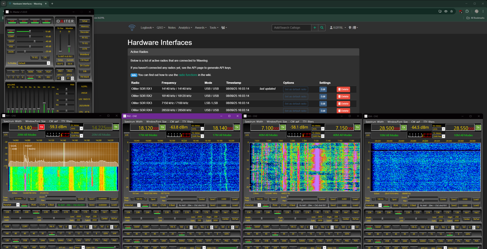
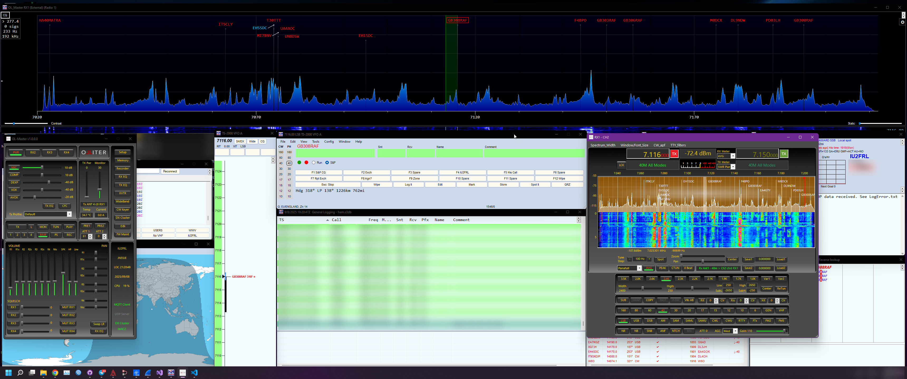

# OL-Master - Additional features

* [Introduction](#introduction)
* [EIBI](#eibi)
* [Clusters](#clusters)
* [CW Keyer](#cw-keyer)
* [MQTT](#mqtt)
  * [Example of Eclipse Mosquitto configuration](#example-of-eclipse-mosquitto-configuration)
  * [MQTT Telemetry data](#mqtt-telemetry-data)
  * [MQTT Receiver control](#mqtt-receiver-control)
    * [MQTT Controls examples](#mqtt-controls-examples)
  * [MQTT Receivers commands](#mqtt-receivers-commands)
    * [MQTT Commands examples](#mqtt-commands-examples)
  * [MQTT Panadapter data](#mqtt-panadapter-data)
* [UDP Stream](#udp-stream)
  * [UDP Panadapter data](#udp-panadapter-data)
    * [UDP Panadapter reception example](#udp-panadapter-reception-example)
  * [UDP Audio stream](#udp-audio-stream)
    * [UDP Audio reception example](#udp-audio-reception-example)
* [Wavelog](#wavelog)
* [N1MM](#n1mm)

## Introduction

The OL-Master software can be optionally configured to use external services like clusters or EIBI, these services might require an internet connection to work or additional configurations in the third-party software.

> [!WARNING]
> Links to, or the usage of, third-party websites, services, plugins, or tools do not constitute an endorsement by Olliter SAgl. of any product, service, information, or disclaimer presented therein. Olliter SAgl. bears no responsibility for any inaccuracies, omissions, or misrepresentations found in the information provided by these external services, and shall not be held liable for any loss, damage, or issues arising from the use of such third-party offerings. These third-party services are optional and external to Olliter SAgl’s control. It is the sole responsibility of the user to independently validate the accuracy, ensure the security, and adapt the implementation or use of any third-party content or tool to meet their specific requirements. As third-party websites and services operate under their own terms of use, privacy policies, and practices, which may differ significantly from those of Olliter SAgl. users are strongly encouraged to carefully review all applicable third-party terms and policies before engaging with or relying on such services.

> [!WARNING]
> Data being transmitted to third-party services or plugins might be unencrypted and could be exposed to security risks during transfer or processing. Olliter SAgl. does not control how third-party services handle, store, or secure your data, and therefore cannot guarantee the confidentiality, integrity, or availability of any information shared with such external tools. Users are solely responsible for assessing the sensitivity of the data they transmit, verifying the security practices of the third-party services they choose to use, and ensuring that any integrations comply with applicable data protection regulations and organizational security requirements. Use of these third-party services is entirely optional and at your own risk. We strongly advise users to take appropriate precautions, including data anonymization, encryption where possible, and reviewing third-party privacy and security policies in detail before transmitting any data.

## EIBI

The EIBI service is a database of shortwave broadcast stations, it can be used to tune the receiver to a specific station, or to display the station name and frequency on the receiver window.

The list of broadcast is retrieved from the provider configured in `Setup > EiBi` and constantly updated. A set of filters can be used to sort or search the list of stations.

The broadcast stations that match the current frequency are highlighted in green in the EiBi window.

When tuning a frequency on the VFO of any receiver, the matching broadcast station will be displayed in the spectrum window.

## Clusters

The cluster service is a database of amateur radio stations, it can be used to tune the receiver to a specific station, or to display the station name and frequency on the receiver window.

If the option is enabled in OL-Master settings, the list of DX stations will be listed in the spectrum window. Double clicking any callsign will tune the receiver to that station.

The cluster can be set to start automatically when running the OL-Master software and the first cluster configured by the user in the list of remote servers will be connected.

## CW Keyer

The CW Keyer feature allows you to send Morse code using a keyboard. The keyer can be configured to use different keying modes, speeds, and other parameters.

User can configure multiple messages to be sent by pressing keys from `F1` to `F12` or by combining the `SHIFT` key with these function keys, for a total of 24 usable messages.

The CW Keyer also supports special syntax for sending variable fields, such as:

* `#C` - The callsign of the DX station as specified in the dedicated field
* `#R` - A report as indicated in the dedicated field (like the signal report or a custom contest exchange like CQ zone, region, etc)
* `#N` - The name of the DX operator as specified in the dedicated field
* `#` - A progressive number that can be incremented from the CW Keyer window (like the progressive number in a CW contest)

> [!TIP]
> If you need to send arbitrary messages using the CW Keyer, you can use the [MQTT commands feature](#receivers-commands) as described below. This allows for more complex messaging scenarios.

## MQTT

The OL-Master software can be configured to send telemetry data to an MQTT broker, this data can be used to monitor the transceiver remotely, or to integrate the transceiver with other software or keypads.

MQTT settings are available in the `Setup > COM > MQTT` menu of the OL-Master software.

> [!WARNING]
> Starting from OL-Master version 1.1.0.4 the internal MQTT broker of OL-Master is now deprecated. The MQTT feature requires an external MQTT broker to be available. An example of a free MQTT broker is [Eclipse Mosquitto](https://mosquitto.org/).

### Example of Eclipse Mosquitto configuration

The installation instructions about the Eclipse Mosquitto broker can be found on the official website: [Mosquitto Documentation](https://mosquitto.org/documentation/).

The setup procedure consists of:

1. Downloading the Eclipse Mosquitto broker installer
2. Installing the Eclipse Mosquitto broker
3. Configuring the Eclipse Mosquitto broker
4. Running the Eclipse Mosquitto broker
   * The broker is automatically installed as a Windows service with no need of manual startup at every reboot

Below is an example of the `mosquitto.conf` file configuration (which is located by default at `C:\Program Files\Mosquitto\mosquitto.conf`) for the MQTT broker to allow both MQTT on port 1883 and MQTT over WebSocket on port 9001 with no authentication:

> [!TIP]
> Make sure to backup the original `mosquitto.conf` file before making any changes.

> [!TIP]
> Restart the Mosquitto service from the Windows Services management console after making any changes to the configuration file or reboot the machine to load the new configuration.

Sample `mosquitto.conf` file:

```conf
# MQTT protocol
listener 1883
protocol mqtt
# WebSocket protocol
listener 9001
protocol websockets
# Authentication should be disabled
# only on local protected networks
allow_anonymous true
```

Using these settings, OL-Master (and any third party software needing to interact with it) should be set as follows:

* `Broker address`: `localhost` (or the IP address of the machine where the broker is running)
* `Broker port`: `9001`
* `Use WebSocket`: true (checked)
* `Use authentication`: false (unchecked)

### MQTT Telemetry data

The telemetry data that is sent to the MQTT broker is a JSON object that contains the following fields:

The telemetry data is sent to the MQTT broker at each interval as configured in the `Setup > COM > MQTT` menu of the OL-Master software.

The telemetry topic is `receivers/get/[x]` where `[x]` is the receiver number, ranging from 1 to 4.

The telemetry data is read-only and cannot be used to control the transceiver.

> [!TIP]
> Please note the `software_id` field is a unique identifier for each OL-Master instance, it is recommended to use this field to distinguish between different transceivers when using multiple instances connected to the same MQTT broker. When sending a command, the software_id must match the one of the target OL-Master instance.

> [!NOTE]
> The `monitor_vol` and `master_vol` fields were expressed as a float value between 0 and 1 in OL-Master version 1.x, starting from version 2.0.0.0 they are expressed as an integer value between 0 and 100.

```javascript
{
  "software_id": "OL-Master_PCNAME", // Read only unique identifier of the software instance
  "txpower": "0",                    // Read only current TX power in Watts
  "monitor_vol": "0.3",              // Read only current monitor volume (0 to 100)
  "band": "B10M",                    // Read and write current band
  "swr": "1",                        // Read only current SWR value
  "master_vol": "0.5",               // Read only current master volume (0 to 100)
  "temperature": "0.0",              // Read only current temperature in Celsius
  "current": "0.0",                  // Read only current consumption in Amperes
  "samplerate": "192000",            // Read and write current sample rate in Hz (throttled to one update every 30 seconds)
  "spectrum_center": "28.131262",    // Read only center frequency of the spectrum in MHz (expecially when CTUN is used)
  "receiver_a":                      // Read and write settings of the main receiver
  {
    "active": "False",               // Read and write if the receiver is active
    "frequency": "28.500000",        // Read and write current frequency in MHz
    "mode": "USB",                   // Read and write current mode
    "filterlow": "250",              // Read and write current low filter in Hz
    "filterhigh": "2650",            // Read and write current high filter in Hz
    "volume": "30",                  // Read and write current volume (0 to 100)
    "squelch": "0",                  // Read and write current squelch level (0 to 100)
    "mox": "False",                  // Read and write if the MOX is active (transmitting)
    "txvfo": "False",                // Read and write if the VFO is used for transmission
    "signal": "-170.0"               // Read only current signal level in dBm
  },
  "receiver_b":                      // Read and write settings of the sub receiver
  {
    "active": "True",                // Read and write if the receiver is active
    "frequency": "28.550000",        // Read and write current frequency in MHz
    "mode": "USB",                   // Read and write current mode
    "filterlow": "250",              // Read and write current low filter in Hz
    "filterhigh": "2650",            // Read and write current high filter in Hz
    "volume": "31",                  // Read and write current volume (0 to 100)
    "squelch": "0",                  // Read and write current squelch level (0 to 100)
    "mox": "False",                  // Read and write if the MOX is active (transmitting)
    "txvfo": "False",                // Read and write if the VFO is used for transmission
    "signal": "-170.0"               // Read only current signal level in dBm
  }
}
```

### MQTT Receiver control

The receiver commands are sent to the MQTT broker using the `receivers/set/[x]` topic, where `[x]` is the receiver number, ranging from 1 to 4.

The JSON payload follows the same structure as the telemetry data, but some the fields are read-write and can be used to control the transceiver.

#### MQTT Controls examples

> [!NOTE]
> The target OL-Master instance is identified by the `software_id` field, make sure to set this field correctly when sending commands. This value should match the one received in the telemetry data for the specific instance.

##### Changing the band on the first receiver

Topic: `receivers/set/1`

Payload:

```json
{
  "software_id": "OL-Master_PCNAME",
  "txpower": null,
  "monitor_vol": null,
  "band": "B30M",
  "swr": null,
  "master_vol": null,
  "receiver_a": null,
  "receiver_b": null
}
```

##### Setting the frequency of the first receiver (main)

Topic: `receivers/set/1`

Payload:

```json
{
  "software_id": "OL-Master_PCNAME",
  "txpower": null,
  "monitor_vol": null,
  "band": "B30M",
  "swr": null,
  "master_vol": null,
  "receiver_a": {
    "active": "True",
    "frequency": "10.100000",
    "mode": "LSB",
    "filterlow": "-2700",
    "filterhigh": "-300",
    "volume": "0",
    "squelch": "0",
    "mox": "False",
    "txvfo": "False",
    "signal": "-170.0"
  },
  "receiver_b": null
}
```

##### Changing the band on the third receiver

Topic: `receivers/set/3`

Payload:

```json
{
  "software_id": "OL-Master_PCNAME",
  "txpower": null,
  "monitor_vol": null,
  "band": "B30M",
  "swr": null,
  "master_vol": null,
  "receiver_a": null,
  "receiver_b": null
}
```

##### Changing the sample rate of the third receiver

Topic: `receivers/set/3`

Payload:

```json
{
  "software_id": "OL-Master_PCNAME",
  "txpower": null,
  "monitor_vol": null,
  "band": null,
  "swr": null,
  "master_vol": null,
  "samplerate": "192000",
  "receiver_a": null,
  "receiver_b": null
}
```

##### Set the frequency of the second receiver (sub)

Topic: `receivers/set/2`

Payload:

```json
{
  "software_id": "OL-Master_PCNAME",
  "txpower": null,
  "monitor_vol": null,
  "band": null,
  "swr": null,
  "master_vol": null,
  "receiver_a": null,
  "receiver_b": {
    "active": "True",
    "frequency": "14.200000",
    "mode": "USB",
    "filterlow": "-2700",
    "filterhigh": "-300",
    "volume": "0",
    "squelch": "0",
    "mox": "False",
    "txvfo": "False",
    "signal": "-170.0"
  }
}
```

##### Set the master volume to 75%

Topic: `receivers/set/1` (any receiver can be used)

Payload:

```json
{
  "software_id": "OL-Master_PCNAME",
  "txpower": null,
  "monitor_vol": null,
  "band": null,
  "swr": null,
  "master_vol": "75",
  "receiver_a": null,
  "receiver_b": null
}
```

##### Set the monitor volume to 50%

Topic: `receivers/set/1` (any receiver can be used)

Payload:

```json
{
  "software_id": "OL-Master_PCNAME",
  "txpower": null,
  "monitor_vol": "50",
  "band": null,
  "swr": null,
  "master_vol": null,
  "receiver_a": null,
  "receiver_b": null
}
```

##### Set the TX power to 80%

Topic: `receivers/set/1` (any receiver can be used)

Payload:

```json
{
  "software_id": "OL-Master_PCNAME",
  "txpower": "80",
  "monitor_vol": null,
  "band": null,
  "swr": null,
  "master_vol": null,
  "receiver_a": null,
  "receiver_b": null
}
```

##### Change the filter of the second receiver (main)

Topic: `receivers/set/2`

Payload:

```json
{
  "software_id": "OL-Master_PCNAME",
  "txpower": null,
  "monitor_vol": null,
  "band": null,
  "swr": null,
  "master_vol": null,
  "receiver_a": {
    "active": "True",
    "frequency": null,
    "mode": null,
    "filterlow": "-1500",
    "filterhigh": "-500",
    "volume": null,
    "squelch": null,
    "mox": null,
    "txvfo": null,
    "signal": null
  },
  "receiver_b": null
}
```

### MQTT Receivers commands

The following commands can be sent to the MQTT broker to send quick commands to the transceiver.

The topic is `receivers/command/[x]` where `[x]` is the receiver number, ranging from 1 to 4.

Supported commands:

* `enable` - Enable or disable the receiver
* `volume` - Adjust the volume of the receiver
* `monitorvolume` - Adjust the monitor volume of the receiver
* `mastervolume` - Adjust the speakers volume
* `mox` - Toggle the MOX
* `frequency` - Adjust the frequency of the receiver
* `mode` - Adjust the mode of the receiver
* `keyer` - Control the transceiver CW keyer

Supported actions:

* `toggle` - Toggle the command
* `+` - Increase the value
* `-` - Decrease the value

The keyer, also supports the following actions:

* `sendmem` - Send a memory from the Keyer list
* `sendtext` - Send arbitrary text

> [!NOTE]
> The MQTT keyer commands feature was introduced with OL-Master version 1.1.0.5
>
> * Maximum length of the text is 100 characters
> * The CW Keyer window should be opened before sending commands to the keyer

The optional `subreceiver` field can be set to `true` to control the sub receiver.

The optional `value` field can be set to the value to increase or decrease. If this parameter is empty, the default value for such command will be used (e.g: the tuning step of the frequency).

#### MQTT Commands examples

> [!NOTE]
> The target OL-Master instance is identified by the `software_id` field, make sure to set this field correctly when sending commands. This value should match the one received in the telemetry data for the specific instance.

##### Toggling the first receiver

Topic: `receivers/command/1`

Payload:

```json
{
  "software_id": "OL-Master_PCNAME",
  "command": "enable",
  "action": "toggle"
}
```

##### Increasing the volume of the second receiver

Topic: `receivers/command/2`

Payload:

```json
{
  "software_id": "OL-Master_PCNAME",
  "command": "volume",
  "subreceiver": "false",
  "action": "+",
  "value": "15" 
}
```

> [!TIP]
> To increase the volume on the sub receiver, set the `subreceiver` field to `true`.

##### Toggling MOX on the first receiver

Topic: `receivers/command/1`

Payload:

```json
{
  "software_id": "OL-Master_PCNAME",
  "command": "mox",
  "action": "toggle",
  "subreceiver": "false"
}
```

##### Increasing the monitor volume

Topic: `receivers/command/1`

Payload:

```json
{
  "software_id": "OL-Master_PCNAME",
  "command": "monitorvolume",
  "action": "+",
  "value": "10",
  "subreceiver": "false"
}
```

##### Setting the monitor volume to 60%

> [!NOTE]
> This feature requires OL-Master version 2.0.0.8 or later.

Topic: `receivers/command/1`

Payload:

```json
{
  "software_id": "OL-Master_PCNAME",
  "command": "monitorvolume",
  "action": "",
  "value": "60",
  "subreceiver": "false"
}
```

##### Decreasing the master volume

Topic: `receivers/command/1`

Payload:

```json
{
  "software_id": "OL-Master_PCNAME",
  "command": "mastervolume",
  "action": "-",
  "value": "10",
  "subreceiver": ""
}
```

##### Setting the master volume to 35%

> [!NOTE]
> This feature requires OL-Master version 2.0.0.8 or later.

Topic: `receivers/command/1`

Payload:

```json
{
  "software_id": "OL-Master_PCNAME",
  "command": "mastervolume",
  "action": "",
  "value": "35",
  "subreceiver": ""
}
```

##### Increasing the frequency of the first receiver (sub)

Topic: `receivers/command/1`

Payload:

```json
{
  "software_id": "OL-Master_PCNAME",
  "command": "frequency",
  "action": "+",
  "value": "0.1",
 "subreceiver": "true"
}
```

The frequency is in MHz, to decrease the frequency, set the `action` field to `-`.

##### Changing the receiver mode of the third transceiver

Topic: `receivers/command/3`

Payload:

```json
{
  "software_id": "OL-Master_PCNAME",
  "command": "mode",
  "action": "",
  "value": "USB",
  "subreceiver": ""
}
```

Allowed values:  `LSB`, `USB`, `DSB`, `CWL`, `CWU`, `AM`, `SAM`, `SAML`, `SAMU`, `DIGL`, `DIGU`, `FM5`, `FM2`, `FT`, `LAST`

##### Sending the message saved in the Keyer list at position 5

Topic: `receivers/command/3`

Payload:

```json
{
  "software_id": "OL-Master_PCNAME",
  "command": "keyer",
  "action": "sendmem",
  "value": "5",
  "subreceiver": "false"
}
```

##### Sending arbitrary text using the keyer

Topic: `receivers/command/3`

Payload:

```json
{
  "software_id": "OL-Master_PCNAME",
  "command": "keyer",
  "action": "sendtext",
  "value": "Hello World",
  "subreceiver": "false"
}
```

### MQTT Panadapter data

The panadapter data can be sent to the MQTT broker using the `receivers/panadapter/[x]` topic, where `[x]` is the receiver number, ranging from 1 to 4.

> [!WARNING]
> The panadapter data transfers a significant amount of data and might overload the MQTT broker or the network if the interval is too low. The UDP stream feature should be preferred for this purpose.

> [!NOTE]
> The spectrum stream is sent to the MQTT broker in different formats depending on the OL-Master version.

#### OL-Master before version 1.1.0.20

```Python
# pip install paho-mqtt

import base64
import gzip
import json
import paho.mqtt.client as mqtt
from io import BytesIO

# MQTT broker settings
MQTT_BROKER = "localhost"  # Change to your broker address
MQTT_PORT = 9001
MQTT_TOPIC = "receivers/panadapter/1"  # Change index as needed

def on_message(client, userdata, msg):
    # Step 1: Decode base64
    compressed_payload = base64.b64decode(msg.payload)
    # Step 2: Decompress (gzip)
    with gzip.GzipFile(fileobj=BytesIO(compressed_payload)) as f:
        json_payload = f.read().decode('utf-8')
    # Step 3: Parse JSON
    data = json.loads(json_payload)
    # Step 4: Access spectrum data
    spectrum = data.get("data", [])
    print(f"Received {len(spectrum)} spectrum points")
    # Print first 10 values for demonstration
    print(spectrum[:10])

client = mqtt.Client(transport="websockets")
client.on_message = on_message
client.connect(MQTT_BROKER, MQTT_PORT)
client.subscribe(MQTT_TOPIC)
client.loop_forever()
```

#### OL-Master after version 1.1.0.20

Starting from OL-Master version 1.1.0.20, the panadapter data format has been updated to a binary stream which includes the minimum and maximum values of the spectrum data. This allows for a more accurate reconstruction of the original floating-point values and a significant improvement in the used bandwidth.

```Python
# pip install paho-mqtt numpy matplotlib

import base64
import struct
import numpy as np
import matplotlib.pyplot as plt
import paho.mqtt.client as mqtt
import queue
import threading

MQTT_BROKER = "localhost"  # Change to your broker address
MQTT_TOPIC = "receivers/panadapter/1"

# Queue to pass data from MQTT thread to main thread
data_queue = queue.Queue()

plt.ion()
fig, ax = plt.subplots()
line, = ax.plot([], [])
ax.set_ylim(-150, 0)  # Adjust as needed

def on_message(client, userdata, msg):
    # Decode and decompress
    payload = base64.b64decode(msg.payload)

    # Parse min, max, int16 data
    min_val = struct.unpack('<f', payload[0:4])[0]
    max_val = struct.unpack('<f', payload[4:8])[0]
    int16_data = np.frombuffer(payload[8:], dtype='<i2')

    # Reconstruct floats
    floats = ((int16_data.astype(np.float32) + 32768) / 65535) * (max_val - min_val) + min_val

    # Put data in queue for main thread to process
    data_queue.put(floats)

# Use the latest callback API version
client = mqtt.Client(callback_api_version=mqtt.CallbackAPIVersion.VERSION2)
client.on_message = on_message
client.connect(MQTT_BROKER)
client.subscribe(MQTT_TOPIC)
client.loop_start()

try:
    while True:
        # Check for new data in queue
        try:
            floats = data_queue.get_nowait()
            # Plot
            line.set_xdata(np.arange(len(floats)))
            line.set_ydata(floats)
            ax.set_xlim(0, len(floats))
            plt.draw()
        except queue.Empty:
            pass
        plt.pause(0.01)
except KeyboardInterrupt:
    pass
```

## UDP Stream

> [!NOTE]
> This chapter is a work in progress

The OL-Master software can be configured to send the audio and spectrum stream to a remote UDP server, this can be used to record the audio stream or to integrate the transceiver with other software.

### UDP Panadapter data

The spectrum stream is sent to the UDP server at each interval as configured in the Setup menu of the OL-Master software.

#### UDP Panadapter reception example

> [!NOTE]
> The spectrum stream is sent to the UDP server in different formats depending on the OL-Master version.

##### UDP Panadapter data in OL-Master before version 1.1.0.20

The following code is an example of how to receive the spectrum stream using a javascript application to render the spectrum on a canvas.

```python
function initializePanadapterCanvas() {
    window.addEventListener('resize', adjustCanvasSize);
    adjustCanvasSize();
}

function adjustCanvasSize() {
    const canvas = document.getElementById('panadapterCanvas');
    if (canvas == null) {
        return;
    }
    const width = window.innerWidth; // Set width to the width of the viewport
    canvas.width = width; // Update the canvas width
    // Optionally, you can set height dynamically or keep it fixed
    canvas.height = 400; // Set height to a fixed value or adjust dynamically
}

window.drawPanadapter = (spectrumData, gridMin = -160, gridMax = 0) => {
    const canvas = document.getElementById('panadapterCanvas');
    if (canvas == null) {
        return;
    }
    const ctx = canvas.getContext('2d');
    const width = canvas.width;
    const height = canvas.height;
    const yRange = gridMax - gridMin;

    ctx.clearRect(0, 0, width, height); // Clear canvas

    const points = [];
    const slope = spectrumData.length / width; // Adjust this as needed

    for (let i = 0; i < width; i++) {
        // Ensure dataIndex is within bounds
        const dataIndex = Math.floor(i * slope);
        const data = spectrumData[Math.min(dataIndex, spectrumData.length - 1)] || 0;
        const yTemp = Math.ceil((gridMax - data) * height / yRange);
        points.push({ x: i, y: Math.min(yTemp, height) });
    }

    // Draw fill polygon if needed
    if (true) { // Adjust condition if necessary
        ctx.fillStyle = 'rgba(185, 152, 106, 0.5)'; // Adjust color and opacity
        points.push({ x: width, y: height }, { x: 0, y: height });
        ctx.beginPath();
        points.forEach((point, index) => {
            if (index === 0) {
                ctx.moveTo(point.x, point.y);
            } else {
                ctx.lineTo(point.x, point.y);
            }
        });
        ctx.closePath();
        ctx.fill();
    }

    // Draw the spectrum line
    ctx.strokeStyle = '#FFFFFF'; // Line color
    ctx.lineWidth = 2; // Line width
    ctx.beginPath();
    points.forEach((point, index) => {
        if (index === 0) {
            ctx.moveTo(point.x, point.y);
        } else {
            ctx.lineTo(point.x, point.y);
        }
    });
    ctx.stroke();

    ctx.strokeStyle = '#00000040';
    ctx.rect(width / 2, 0, 1, height);
    ctx.stroke();
};
```

##### UDP Panadapter data in OL-Master version 1.1.0.20 or later

Starting from OL-Master version 1.1.0.20, the spectrum stream format has been updated to a binary stream which includes the minimum and maximum values of the spectrum data. This allows for a more accurate reconstruction of the original floating-point values and a significant improvement in the used bandwidth.

```Python
# pip install numpy matplotlib

import socket
import struct
import matplotlib.pyplot as plt
import numpy as np

UDP_IP = "0.0.0.0"
UDP_PORT = 50500  # Set to your UDP port

sock = socket.socket(socket.AF_INET, socket.SOCK_DGRAM)
sock.bind((UDP_IP, UDP_PORT))

plt.ion()
fig, ax = plt.subplots()
line, = ax.plot([], [])
ax.set_ylim(-150, 0)  # Adjust as needed

def parse_packet(data):
    # Find the end of the label (last '|')
    label_end = data.find(b'|', data.find(b'|', data.find(b'|')+1)+1) + 1
    min_val = struct.unpack('<f', data[label_end:label_end+4])[0]
    max_val = struct.unpack('<f', data[label_end+4:label_end+8])[0]
    buffer = data[label_end+8:]
    buffer = buffer[:len(buffer) - (len(buffer) % 2)]  # Ensure buffer size is a multiple of 2
    int16_data = np.frombuffer(buffer, dtype='<i2')
    # Reconstruct floats
    floats = ((int16_data.astype(np.float32) + 32768) / 65535) * (max_val - min_val) + min_val
    return floats

while True:
    data, addr = sock.recvfrom(65536)
    floats = parse_packet(data)
    line.set_xdata(np.arange(len(floats)))
    line.set_ydata(floats)
    ax.set_xlim(0, len(floats))
    plt.pause(0.01)
```

### UDP Audio stream

The audio stream is sent to the UDP server as raw audio data, this can be used to record the audio stream or to integrate the transceiver with other software.

#### UDP Audio reception example

The following Python code is an example of how to receive the audio stream using the `sounddevice` library.

```python
import socket
import pyaudio
import numpy as np

# Configurazione UDP
UDP_IP = "127.0.0.1"  # Ascolta su tutte le interfacce
UDP_PORT = 5000    # Porta UDP
BUFFER_SIZE = 1024  # Dimensione del pacchetto UDP

# Configurazione audio
FORMAT = pyaudio.paFloat32  # Supponendo che i dati siano float32
CHANNELS = 2                # Audio mono
RATE = 48000                # Frequenza di campionamento

# Configura PyAudio
p = pyaudio.PyAudio()
stream = p.open(format=FORMAT,
                channels=CHANNELS,
                rate=RATE,
                output=True)

# Configura socket UDP
sock = socket.socket(socket.AF_INET, socket.SOCK_DGRAM)
sock.bind((UDP_IP, UDP_PORT))
print(f"Ricezione audio su {UDP_IP}:{UDP_PORT}...")

try:
    while True:
        data, addr = sock.recvfrom(BUFFER_SIZE)
        
        # Decodifica i dati (supponendo double -> float)
        audio_data = np.frombuffer(data, dtype=np.float64).astype(np.float32)
        
        # Riproduci il buffer
        stream.write(audio_data.tobytes())
except KeyboardInterrupt:
    print("Terminato.")
finally:
    stream.stop_stream()
    stream.close()
    p.terminate()
    sock.close()

```

## Wavelog



[Wavelog](https://github.com/wavelog/wavelog) is an open-source, web-based and self-hosted logging software with extensive features to interface with external services like QSL management and live or contest logging.

> [!NOTE]
> The Wavelog integration feature requires OL-Master version 1.1.0.13 or later.

In the `Setup > COM > Wavelog section`, you can configure the integration with Wavelog, by providing the few required parameters.

* `Wavelog URL`: The base URL of the Wavelog instance (e.g., `https://wavelog.example.com/`).
  * No additional paths should be added, just the base URL of the Wavelog instance as indicated in the API key page of the Wavelog software
* `API Key`: An API key for the user account in Wavelog where radio interfaces should be synched.
  * The API key must be configured with both read and write access
* `Radio name`: An optional parameter used to distinguish between different radio interfaces.
  * If no radio name is provided, the default `Olliter SDR` name will be used

After configuring the Wavelog integration, you should click the `Apply + Test` button to verify the connection.

> [!TIP]
> Refer to the Wavelog documentation for more details on how to configure APIs, radio interfaces and callbacks.

### Radio interfaces

If this feature is enabled, the transceiver will periodically send updates to the Wavelog instance with the current state of the radio interfaces. This includes information such as frequency, mode, and other relevant parameters.

The update interval can be adjusted as needed.

To ensure proper functionality, you can access the Wavelog instance, look for the `Hardware interfaces` option in the user menu and make sure all four radio interfaces are listed and displaying correctly.

> [!TIP]
> Using a faster refresh rate (smaller interval) might overload the Wavelog instance, the recommended minimum value is 1000 milliseconds.

### Radio callbacks

If this feature is enabled, Wavelog will be able to control the transceiver remotely. This includes changing frequency and mode.

For this feature to work, please make sure to:

* Each transceiver should be assigned to a different TCP port in the `Setup > COM > Wavelog` menu of OL-Master
  * The default ports are 54321, 54322, 54323 and 54324 for RX1, RX2, RX3 and RX4 respectively
  * Make sure the selected ports are not blocked by any firewall or already in use by other applications
* Each of the four transceivers that are automatically populated in the `Hardware interfaces` section of Wavelog should be assigned to the corresponding callback address TCP port as configured in OL-Master
  * The address is always localhost, only the port should differ, for example:
    * RX1: `http://127.0.0.1:54321`
    * RX2: `http://127.0.0.1:54322`
    * RX3: `http://127.0.0.1:54323`
    * RX4: `http://127.0.0.1:54324`

## N1MM



> [!NOTE]
> The N1MM integration feature requires OL-Master version 1.1.0.26 or later.

OL-Master is capable of sending panadapter data to N1MM logging software. This allows for seamless integration between the two applications, enabling users to take full advantage of the features offered by both.

### OL-Master settings

Using the dedicated settings at `Setup > COM > N1MM` you can enable the spectrum forwarding to N1MM.

> [!TIP]
> To ensure proper visualization of the spectrum data, the zoom level in the receiver window of OL-Master should be set to minimum (no zoom).

There are also additional settings that can be customized:

* `Target address`: The IP address of the machine where N1MM is running. By default it is `127.0.0.1`.
* `Target port`: The port number on which N1MM is listening for incoming connections. By default it is `12060`.
* `Send interval`: The interval at which panadapter data is sent to N1MM. By default it is `333 ms`.
  * As per N1MM documentation, refresh should happen only 3-4 times per second.
* `Scaling factor`: A scaling factor to apply to the panadapter data before sending it to N1MM. By default it is `0.5`.
  * Increasing this value will make the spectrum "taller", while decreasing this value will make it "shorter".
* `Spectrum offset`: An offset to apply to the panadapter data before sending it to N1MM. By default it is `120`.
  * Increasing the value will shift the spectrum upwards, while decreasing the value will shift it downwards.

### N1MM settings

In the N1MM waterfall window, click the "Settings" button (gear icon) to access the N1MM settings and then set:

* `Spectrum source`: Set this to `External (WB, Flex, etc)`.
* `Source Options`: Select which of the active receivers spectrum to display.
* `Binary bins`: Set this to the desired resolution of the spectrum.
