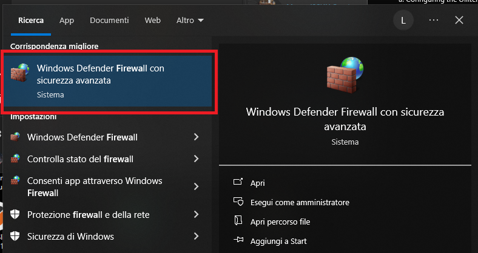
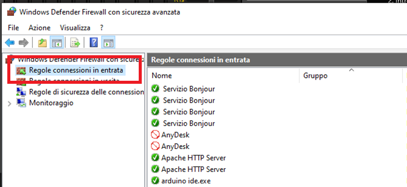
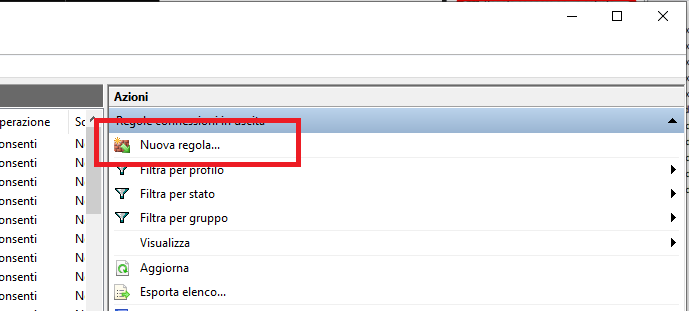
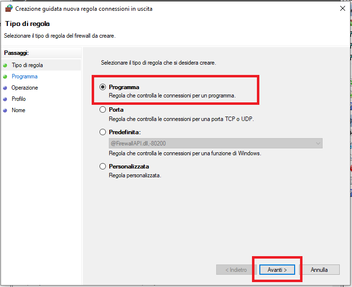
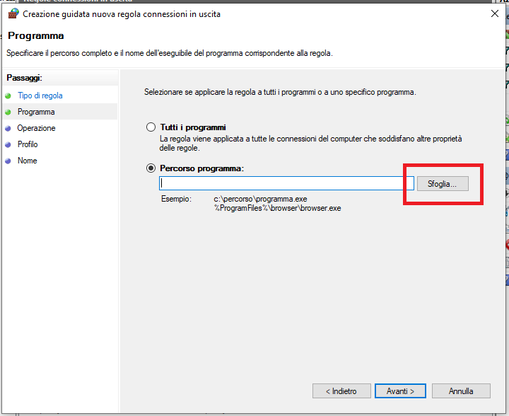
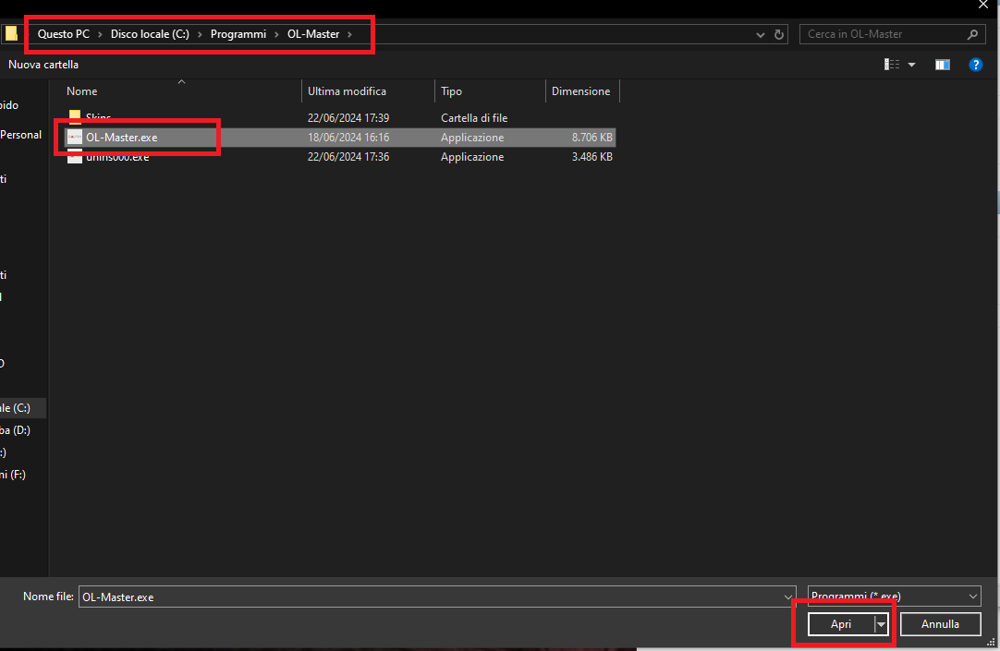
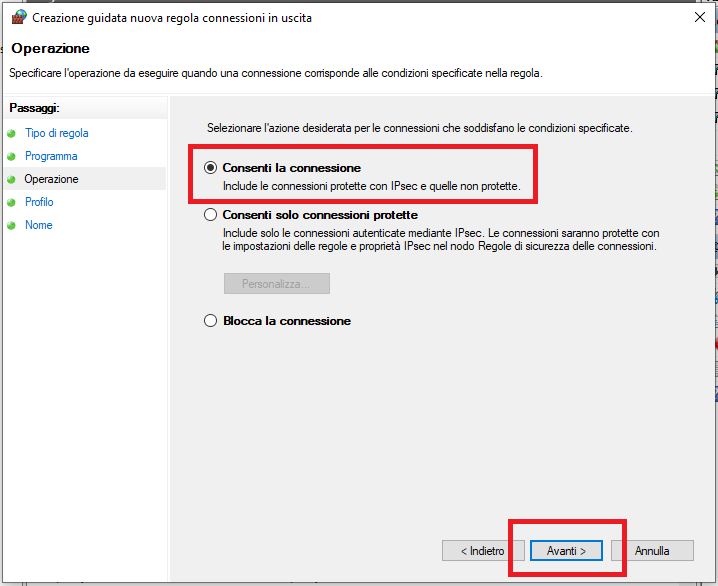
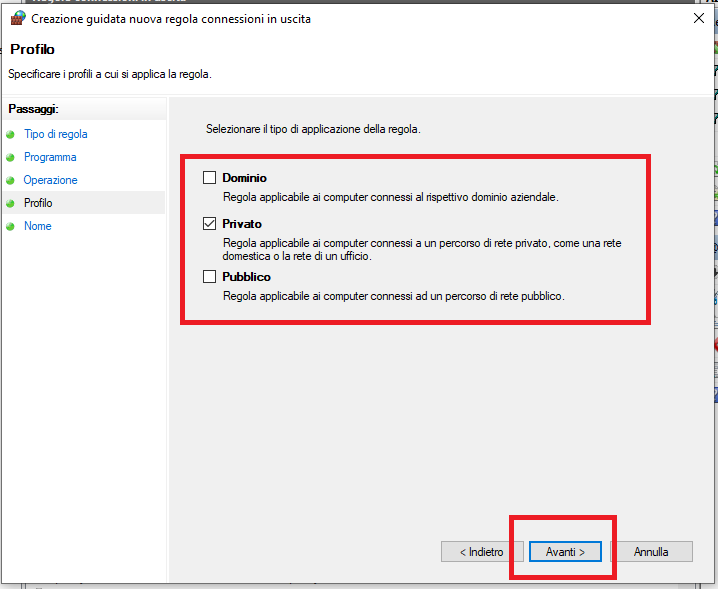
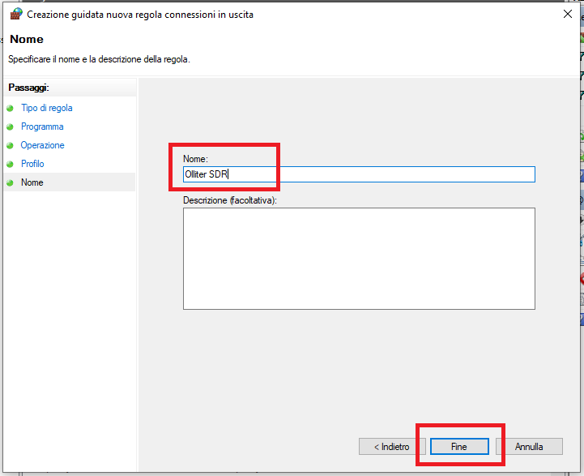

# Configuring the Firewall for OL-Master Software

Network communication to the device is performed using UDP protocol, a security system exception must be created for the software to work reliably.

> [!TIP]
> Starting from OL-Master software version 2.0.0.3, the firewall exception is created during the installation process if you choose to allow it. If you are using an older version of the software, or if you want to manually create the exception, please follow the instructions below.

Open the Windows firewall settings.

Select "Inbound connection rules" on the left menu.

Click on "New rule" on the right menu.

Select \"Program" and click "next".

Click on "Browse" and navigate to `C:/Program Files/Olliter/Ol-master.exe`

Click on "Next"

Select "Allow connections" and click "Next".

Now select the kind of network that you are using, by default it should be "Private", if you are using a different kind of network, please select the option that best fits your configuration.

Insert any name you like and then click on "Complete".

