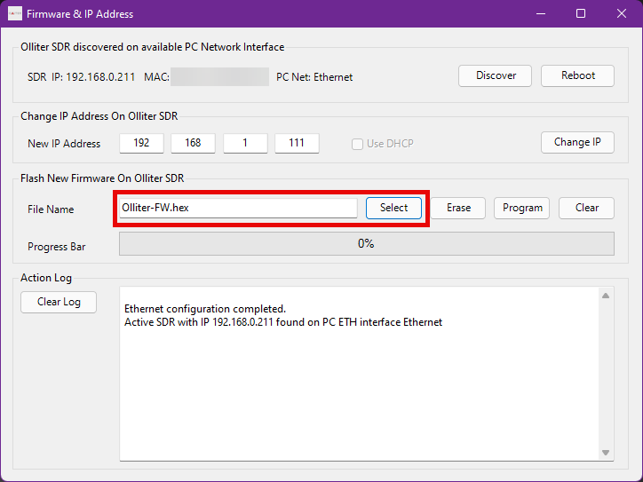
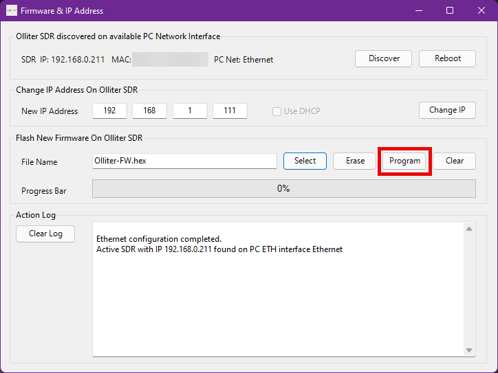

# OL-Master Firmware Upgrade Guide

> [!WARNING]
> Although the Olliter SDR has a recovery mode that can be enabled in case of major firmware failures, the firmware upgrade is a delicate process that requires some attention. Please read this chapter carefully before starting the procedure.

Upgrade of the firmware is performed using the OL-Master application with a dedicated menu.

> [!WARNING]
> Make sure to close all background apps and to have a reliable power source for both the PC and the transceiver before attempting a firmware upgrade.

Extract the ZIP file containing the firmware anywhere on the local PC to
get the *.hex* file which contains the new firmware.

> [!WARNING]
> Extract the file on the local hard drive, do not use USB sticks, network drive or other unreliable locations that may create latency or issues.

Once the file is extracted you should see something like this:

Make sure the transceiver is ON and reachable on the local network, then open OL-Master and select the *FW Maintenance* menu. The SDR should be detected automatically by the software.

Using the Select button, navigate to the .hex file that was just extracted and select it.

Once the file is selected, click the Program button to start the upgrade
procedure.

> [!WARNING]
> The upgrade procedure will take about a minute, please be patient.

At first, the software will erase the content of the FPGA, this is a monolithic task, so the software may look like it's frozen, please be patient and just wait for the process to complete. Once the erase task is completed, you should see the progress bar moving, and when it reaches 100%, the transceiver should be restarted automatically.

> [!WARNING]
> If the process hangs after some minutes, or if any error occurs, please contact our customer assistance to get further assistance.

Wait for the upgrade window to close automatically after a couple of seconds, then the process is complete, and the transceiver can be used as normal.
