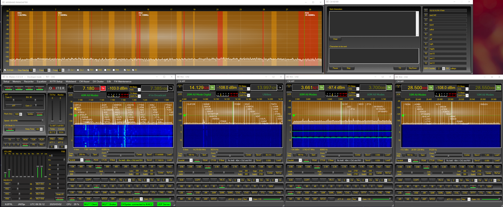
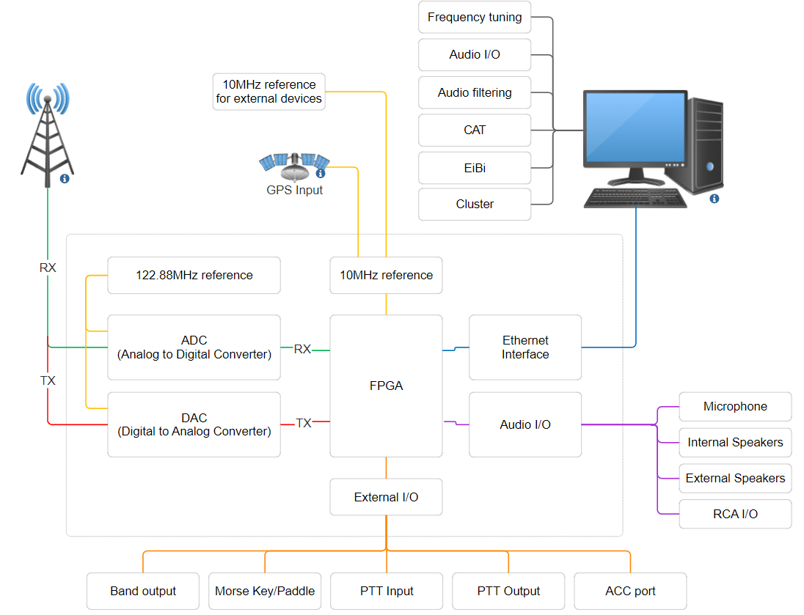

# OL-Master Software User Manual

## Contents of this manual

1. [Important user notice](#important-user-notice)
2. [Introduction](#introduction)
3. [System requirements](#system-requirements)
    * [Software requirements](#software-requirements)
      * [Operating system requirements](#operating-system-requirements)
      * [.NET 8](#net-8)
      * [Microsoft Visual C++ Redistributable](#microsoft-visual-c-redistributable)
    * [Hardware requirements](#hardware-requirements)
    * [Network requirements](#network-requirements)
4. [Installing OL-Master](#installing-ol-master)
    * [Configuring the firewall](#configuring-the-firewall)
5. [Usage of OL-Master](#usage-of-ol-master)
    * [Configuring OL-Master](#configuring-ol-master)
      * [Configuring the Olliter SDR address](#configuring-the-olliter-sdr-address)
      * [Configuring the operator settings](#configuring-the-operator-settings)
      * [Configuring the audio interface](#configuring-the-audio-interface)
      * [Configuring the receiver bandwidth](#configuring-the-receiver-bandwidth)
      * [Configuring the refresh rate](#configuring-the-refresh-rate)
    * [Starting the device](#starting-the-device)
    * [Controlling the transceiver](#controlling-the-transceiver)
      * [Selecting a different band](#selecting-a-different-band)
      * [Tuning a frequency](#tuning-a-frequency)
      * [Setting the visualization mode](#setting-the-visualization-mode)
      * [Interacting with the spectrum](#interacting-with-the-spectrum)
      * [Setting the receiver mode](#setting-the-receiver-mode)
      * [Adding additional receivers](#adding-additional-receivers)
      * [Adjusting the receivers volume](#adjusting-the-receivers-volume)
      * [DSP options](#dsp-options)
    * [Firmware upgrade](#firmware-upgrade)
6. [General recommendations](#general-recommendations)
7. [Troubleshooting](#troubleshooting)

## Important user notice

Before installing and using the OL-Master software, please read carefully:

* The [Software and Hardware License Agreements](../General/README.md) manual.
* Any manual regarding the specific transceiver or Olliter device you are about to use.

## Introduction

The main purpose of this guide is to help you configuring for the first time your Olliter OL-Master software and the basic operations.

This guide may not fully cover every feature available on the software and it will be updated frequently.

## System requirements

An SDR transceiver requires a control device to work, the hardware of the transceiver is used to convert analog RF signals to an IQ stream
that is sent to a software installed on the control device, where it is processed to extract an audio signal. When transmitting, the process is
reversed. The hardware and software need to work together to receive and transmit signals using the SDR transceiver.

Some I/O are available on-board to interface with external accessories like microphones, headphones and Morse key or paddle.

A simplified schematic representation of the SDR device is shown below.

### Software requirements

As any SDR device, one of the main components is the PC that is used to control the device, the same PC is also used to decode and process the raw digital stream of data to usable audio stream. This decode process requires some minimum software and hardware requirements that should be met.

#### Operating system requirements

The OL-Master application was developed for Microsoft Windows 10 or later. Virtualization of such operating systems is also supported, if the host machine is capable enough.

> [!NOTE]
> Compatibility with Microsoft Windows 8.1 or previous versions of Microsoft Windows cannot be ensured due to lack of support for the latest .NET modules which was used to develop the application.

#### .NET 8

The operating system should be updated to the latest version and the .NET8 must be installed on the machine (latest update of the .NET8 can be downloaded from the Microsoft).

Depending on the system configuration, both the .NET8 SDK and .NET8 Runtime might be needed.

* .NET8 Link: <https://dotnet.microsoft.com/it-it/download/dotnet/thank-you/runtime-desktop-8.0.13-windows-x64-installer>
* .NET8 SDK Link: <https://dotnet.microsoft.com/it-it/download/dotnet/thank-you/sdk-8.0.406-windows-x64-installer>

#### Microsoft Visual C++ Redistributable

Some components of the software were written using highly optimized C++ code, this requires the latest version of the Microsoft Visual C++ Redistributable package to be installed and updated. The latest version of this package can be downloaded from the following URL:

* VC Redist: <https://learn.microsoft.com/it-it/cpp/windows/latest-supported-vc-redist?view=msvc-170>

As per the moment this manual was written, the latest available version is 14.40.33810.0.

### Hardware requirements

Recommended hardware setup is an 7th generation Intel Core i5 or later, with at least 16GB of RAM and 1GB of available storage space (disk usage may vary depending on additional features like recordings, cluster, EIBI and more).

Ethernet interface at 1Gbps on the control PC is mandatory if using more than one receiver window. Ethernet interface at 1Gbps is mandatory to configure the IP address of the device if connected directly to the control PC.

### Network requirements

An ethernet interface capable of 1Gbps **is mandatory** for the transceiver to communicate with the control device (PC), a properly configured ethernet switch with interfaces at 1Gbps is suggested to be used in between the SDR and the PC.

Please note, the transceiver **does not support negotiating any speed lower than 1Gbps** with the control device or the switch/router that is plugged into.

An ethernet cable CAT5 or superior is highly recommended to interface the SDR to the switch/router and the PC.

To ensure best performances, use high quality switch or router and cables, make sure the whole network from the SDR to the master PC is capable of continuously communicate at 1Gbps.

An internet connection is not required if not using external services (like clusters or EIBI).

The network connection diagram is available in the transceiver manual.

## Installing OL-Master

After buying an Olliter SDR, you should receive the setup file for OL-Master, this is the main application that controls the SDR and must be installed on the PC.

Double click the executable to start the installer, administrative
privileges are mandatory to install the software. Follow the on-screen
instructions to proceed with the installation.

Setup is now completed, before starting the software, please read carefully the next chapter.

### Configuring the firewall

Network communication to the device is performed using UDP protocol, a security system exception must be created for the software to work reliably.

Open the Windows firewall settings.

Select "Inbound connection rules" on the left menu.

Click on "New rule" on the right menu.

Select \"Program" and click "next".

Click on "Browse" and navigate to `C:/Program
Files/Olliter/Ol-master.exe`

Click on "Next"

Select "Allow connections" and click "Next".

Now select the kind of network that you are using, by default it should
be "Private", if you are using a different kind of network, please
select the option that best fits your configuration.

Insert any name you like and then click on "Complete".

## Usage of OL-Master

### Configuring OL-Master

All the following settings are accessed using the Setup menu of the OL-Master application, in OL-Master, click the Setup menu, then follow the subsequent instructions.

Settings are persisted using the *Save* or the *Save and Close* buttons.

#### Configuring the Olliter SDR address

In *General* \> *HW Config* make sure the "*Use static IP Address*" option is enabled, then insert the IP address of the Olliter SDR that was configured.

This address is 192.168.1.111 by default, if it was manually changed following the above procedure, please input the new IP address that was configured.

Once the IP address has been configured and selected (using the radio button on the right), click Save and close the dialog box.

#### Configuring the operator settings

In *General* \> *Options*, set the callsign and grid locator of the station.

#### Configuring the audio interface

If the user wants to enable the audio to be routed to the master PC, the following procedure is needed.

In *Audio* \> *Audio & Common VAC* configure the *Driver* to MME, select the desired *Input* and *Output* devices, then select "*Enable PC Speaker via common VAC*".

The onboard speakers can be deactivated using the "*Local speaker disable*" option.

If a microphone is connected to the radio, the RX Only option can be checked to exclude audio transmission from the PC

#### Configuring the receiver bandwidth

The SDR is capable of receiving and displaying a wide area of the RF spectrum, the receiver span can be configured in *General* \> *HW Config* \> *Sample Rate*.

The spectrum span that is rendered is roughly the 80% of the sample rate set in the settings menu, for example if 192000 samples per second are selected, the displayed spectrum will be roughly 180KHz.

> [!TIP]
> The recommended sample rate is 192000 samples per second.

> [!WARNING]
> As the sample rate is increased, more system and network resources will be required by the software, please adjust the settings accordingly
  

#### Configuring the refresh rate

The refresh rate of the receivers windows can be adjusted in *Display* \> *General*. The suggested value is between 10 and 20 frames per second.

> [!WARNING]
> Increasing the refresh rate can significantly impact the system load, if the system starts lagging or the UI starts behaving, reduce the "Main Display FPS" value 

### Starting the device

Once the device settings were configured by the user, the device can now be started using the PWR button, the spectrum should animate, and audio will start.

### Controlling the transceiver

This chapter will cover the main settings of the OL-Master software, such as changing band, changing mode or interacting with the spectrum.

#### Selecting a different band

The transceiver can operate on all amateur bands of HF plus the 50MHz (6mt) band. The received band can be selected using the dedicated buttons.

#### Tuning a frequency

There are multiple ways to tune the received frequency, the main ones are by panning the receiver spectrum or by selecting the frequency using the dedicated numeric input.

#### Setting the visualization mode

Different viewing modes can be selected for the receivers, each band will save the view setting that is restored every time the band is recalled.

#### Interacting with the spectrum

The receiver spectrum can be interacted using the spectrum controls, these allows zooming, panning and setting the tune step.

The spectrum can be rendered to display the average or the peak
mode.

#### Setting the receiver mode

All main operative modes are supported by the transceiver, this can be selected using the dedicated buttons.

Then, for each operating mode, the bandwidth can be adjusted as needed.

#### Adding additional receivers

RX1 is located in the main window of the software, additional receivers can be enabled using the RX2, RX3 and RX4 buttons in the main window.

> [!WARNING]
> Using additional receivers may significantly impact the system load, if the system starts to lag, reduce the number of receivers, or reduce the sample rate.

#### Adjusting the receivers volume

The main and sub volumes, per each receiver can be configured using the
*Volume* controls group.

#### DSP options

Multiple software-based filters can be added to any receiver mode, these can significantly improve the reception of a given signal. Some filters are tuned to improve the voice quality, others to remove clicking, background noise or unwanted whistles. Filters can be enabled using the dedicated buttons.

### Firmware upgrade

Upgrade of the firmware is performed using the OL-Master application with a dedicated menu.

> [!WARNING]
> Although the Olliter SDR has a recovery mode that can be enabled in case of major firmware failures, the firmware upgrade is a delicate process that requires some attention. Please read this chapter carefully before starting the procedure.

> [!WARNING]
> Make sure to close all background apps and to have a reliable power source for both the PC and the transceiver before attempting a firmware upgrade.

Extract the ZIP file containing the firmware anywhere on the local PC to
get the *.hex* file which contains the new firmware.

> [!WARNING]
> Extract the file on the local hard drive, do not use USB sticks, network drive or other unreliable locations that may create latency or issues.

Once the file is extracted you should see something like this:

Make sure the transceiver is ON and reachable on the local network, then open OL-Master and select the *FW Maintenance* menu. The SDR should be detected automatically by the software.

Using the Select button, navigate to the .hex file that was just extracted and select it.

Once the file is selected, click the Program button to start the upgrade
procedure.

> [!WARNING]
> The upgrade procedure will take about a minute, please be patient.

At first, the software will erase the content of the FPGA, this is a monolithic task, so the software may look like it's frozen, please be patient and just wait for the process to complete. Once the erase task is completed, you should see the progress bar moving, and when it reaches 100%, the transceiver should be restarted automatically.

> [!WARNING]
> If the process hangs after some minutes, or if any error occurs, please contact our customer assistance to get further assistance.

Wait for the upgrade window to close automatically after a couple of seconds, then the process is complete, and the transceiver can be used as normal.

## General recommendations

Please see: [General recommendations](./GeneralRecommendations.md)

## Troubleshooting

Please see: [Troubleshooting](./Troubleshooting.md)
