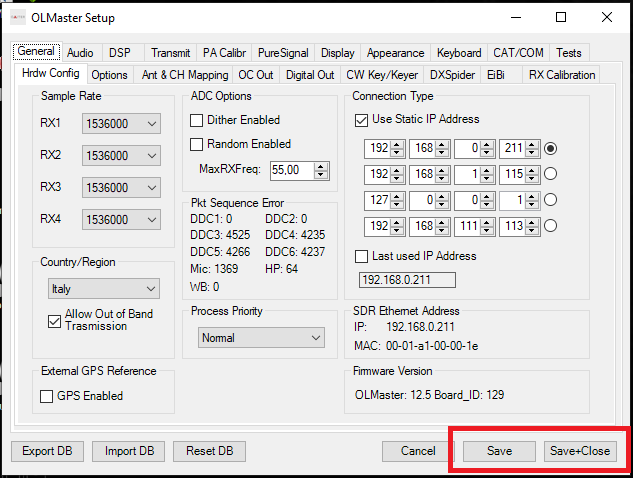
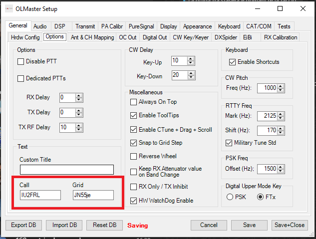
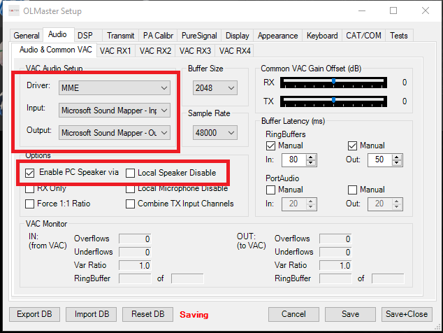
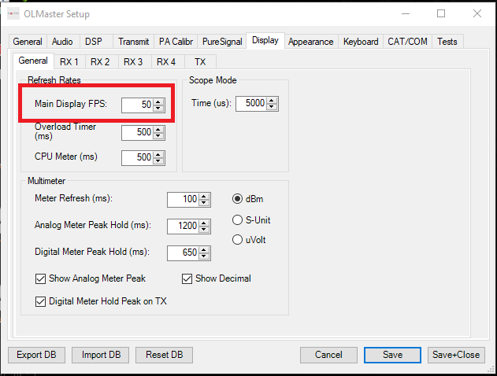

# OL-Master Software User Manual

## Contents of this manual

1. [Important user notice](#important-user-notice)
    * [Software license](#software-license)
1. [Introduction](#introduction)
    * [OL-Master features](#ol-master-features)
1. [System requirements](#system-requirements)
    * [Software requirements](#software-requirements)
      * [Operating system requirements](#operating-system-requirements)
      * [.NET 8](#net-8)
      * [Microsoft Visual C++ Redistributable](#microsoft-visual-c-redistributable)
    * [Hardware requirements](#hardware-requirements)
    * [Network requirements](#network-requirements)
1. [Installing OL-Master](#installing-ol-master)
    * [Automatic update check](#automatic-update-check)
    * [Upgrading OL-Master](#upgrading-ol-master)
    * [Configuring the firewall](#configuring-the-firewall)
1. [Usage of OL-Master](#usage-of-ol-master)
    * [Configuring OL-Master](#configuring-ol-master)
      * [Configuring the Olliter SDR address](#configuring-the-olliter-sdr-address)
      * [Configuring the operator settings](#configuring-the-operator-settings)
      * [Configuring the audio interface](#configuring-the-audio-interface)
      * [Configuring the receiver bandwidth](#configuring-the-receiver-bandwidth)
      * [Configuring the refresh rate](#configuring-the-refresh-rate)
    * [Starting the device](#starting-the-device)
    * [Controlling the transceiver](#controlling-the-transceiver)
      * [Selecting a different band](#selecting-a-different-band)
      * [Tuning a frequency](#tuning-a-frequency)
      * [Setting the visualization mode](#setting-the-visualization-mode)
      * [Interacting with the spectrum](#interacting-with-the-spectrum)
      * [Setting the receiver mode](#setting-the-receiver-mode)
      * [Adding additional receivers](#adding-additional-receivers)
      * [Adjusting the receivers volume](#adjusting-the-receivers-volume)
      * [DSP options](#dsp-options)
      * [Notch filter](#notch-filter)
        * [Defining a notch filter](#defining-a-notch-filter)
        * [Deleting a notch filter](#deleting-a-notch-filter)
        * [Notch filter considerations](#notch-filter-considerations)
      * [AGC and Gain Control](#agc-and-gain-control)
        * [AGC Modes](#agc-modes)
        * [Gain (Threshold)](#gain-threshold)
        * [Hang Time](#hang-time)
        * [Slope](#slope)
        * [Other options](#other-options)
    * [Firmware upgrade](#firmware-upgrade)
1. [Additional features](#additional-features)
1. [General recommendations](#general-recommendations)
1. [Frequently Asked Questions](#frequently-asked-questions)
1. [Troubleshooting](#troubleshooting)

## Important user notice

Before installing and using the OL-Master software, please read carefully:

* The [Software and Hardware License Agreements](../General/README.md) manual.
* Any manual regarding the specific transceiver or Olliter device you are about to use.

### Software license

This software, OL-Master, is derived from PowerSDR. The original PowerSDR software and our derived version are distributed under the terms of the GNU General Public License (GPL), version 2, or any later version as published by the Free Software Foundation.

Please read the related documents at:

* [OL-Master Software License](./SoftwareLicense.md).
* [Olliter software history, licensing and FAQs](https://www.olliter.com/ol-master-licence.html)

## Introduction

The main purpose of this guide is to help you configuring for the first time your Olliter OL-Master software and the basic operations.

This guide may not fully cover every feature available on the software and it will be updated frequently.

### OL-Master features

OL-Master provides a complete set of features to control and manage the Olliter SDR transceivers, here is a brief list of some of the main features available:

* A new user interface with 4 detached receiver windows
  * Each receiver window can be moved and resized independently
  * Each receiver window can be set to different visualization modes (Panadapter, Spectrum, Panaspectrum)
  * Each receiver window can be set to different sample rates and bandwidths
  * Each receiver window has independent settings menus
* Improved performance and stability
  * The UI thread was completely rewritten with modern .NET technologies to ensure a smooth experience
  * A completely new UI algorithmwas developed to ensure low latency and high responsiveness in spectrum rendering
* Overall CPU usage was reduced significantly (up to 50% less CPU usage in our tests)
* Improved SO2R support with N1MM
* Improved CW keyer interface
* CW decoder integrated into the software

## System requirements

An SDR transceiver requires a control device to work, the hardware of the transceiver is used to convert analog RF signals to an IQ stream
that is sent to a software installed on the control device, where it is processed to extract an audio signal. When transmitting, the process is
reversed. The hardware and software need to work together to receive and transmit signals using the SDR transceiver.

Some I/O are available on-board to interface with external accessories like microphones, headphones and Morse key or paddle.

A simplified schematic representation of the SDR device is shown below.

### Software requirements

As any SDR device, one of the main components is the PC that is used to control the device, the same PC is also used to decode and process the raw digital stream of data to usable audio stream. This decode process requires some minimum software and hardware requirements that should be met.

#### Operating system requirements

The OL-Master application was developed for Microsoft Windows 11 or later. Virtualization of such operating systems is also supported if the host machine is capable enough.

> [!NOTE]
> Compatibility with Microsoft Windows 8.1 or previous versions of Microsoft Windows cannot be ensured due to lack of support for the latest .NET modules which was used to develop the application.

#### .NET 8

The operating system should be updated to the latest version, and the .NET 8 runtime must be installed on the machine (download the latest runtime from the Microsoft website if needed).

Depending on the system configuration, both the .NET 8 SDK and .NET 8 Runtime might be needed.

> [!TIP]
> The required version of .NET is automatically downloaded and installed during the first setup of the software, if the PC is connected to the internet.

#### Microsoft Visual C++ Redistributable

Some components of the software were written using highly optimized C++ code, this requires the latest version of the Microsoft Visual C++ Redistributable package to be installed and updated. The latest version of this package can be downloaded from the following URL:

> [!TIP]
> The required version of Microsoft Visual C++ Redistributable is automatically downloaded and installed during the first setup of the software, if the PC is connected to the internet.

### Hardware requirements

> [!WARNING]
> OL-Master requires AVX2 instruction set which was introduced with the Haswell series of Intel® CPUs (4th generation Intel® Core i series), any CPU older than Intel® Core i5 4th generation **cannot be used**. For optimal performances, we highly recommend an Intel® Core i5 7th generation or later.

Recommended hardware setup is an 7th generation Intel® Core i5 or later, with at least 16GB of RAM and 2GB of available storage space

> [!TIP]
> The disk and RAM usage may vary depending on additional features like recordings, cluster, EIBI, receiver bandwidth, number of receivers, and more.

Ethernet interface at 1Gbps on the control PC is a mandatory requirement between the SDR and the PC (and/or any other device in between).

### Network requirements

> [!WARNING]
> The transceiver does not accept any link speed slower than 1Gbps. Network devices running at 10/100Mbps are not supported and will not work.

An ethernet interface capable of 1Gbps **is mandatory** for the transceiver to communicate with the control device (PC), a properly configured ethernet switch with interfaces at 1Gbps is suggested to be used in between the SDR and the PC.

Please note, the transceiver **does not support negotiating any speed lower than 1Gbps** with the control device or the switch/router that is plugged into.

An ethernet cable CAT5 or superior is highly recommended to interface the SDR to the switch/router and the PC.

To ensure best performances, use high quality switch or router and cables, make sure the whole network from the SDR to the master PC is capable of continuously communicate at 1Gbps.

An internet connection is not required if not using external services (like clusters or EIBI).

The network connection diagram is available in the transceiver manual.

## Installing OL-Master

After buying an Olliter SDR, you should receive the setup file for OL-Master, this is the main application that controls the SDR and must be installed on the PC.

The OL-Master software is distributed in two separate files, one for the first installation and one for the update. The two files are:

* `OL-Master_First_Setup_[version].exe`: This is the main setup file that must be used to install the software for the first time. It will install all the required components and dependencies in additions to the basic configuration files (like band plans, memories, default settings, etc).
  * This file can be used to install the software on a new PC or to reinstall the software on an existing PC.
* `OL-Master_Update_[version].exe`: This is the update file that can be used to update the software to the latest version. It will only update the existing installation and will not install any additional components or dependencies.
  * This file will not be available for the first installation, it will be available only after the first installation of the software.
  * This file will not overwrite the existing configuration files, so if you want to reset the configuration files to the default values, you need to delete the existing configuration files manually.

The first install or update procedures are almost identical, the only difference is that the first install will install all the required components and dependencies, while the update package will only update the existing installation without overwriting any user data or settings.

The setup procedure is described at this link: [Installing or Updating OL-Master](./SoftwareSetup.md)

### Automatic update check

There is currently no automatic update check; users must manually check for updates by visiting the [Olliter website](https://olliter.com) or by contacting the customer care team.

We are actively working to implement an automatic update check mechanism in the future. We apologize for the inconvenience and we appreciate your understanding.

### Upgrading OL-Master

To upgrade OL-Master to the latest version, please download the latest update file and run it. The update process is similar to the initial installation process, and you will be guided through the necessary steps.

You will be prompted to update the existing band plans if newer versions are available.

No user settings will be changed during the update process.

### Configuring the firewall

> [!TIP]
> The firewall must be properly configured for the transceiver to work. If the firewall fails to configure during OL-Master installation, the software won't be able to communicate with the OL-SDR device

If the OL-Master software turns on the radio, the powers off immediately, please manually adjust the firewall settings by following the instructions in [Configuring Firewall](./ConfiguringFirewall.md)

## Usage of OL-Master

### Configuring OL-Master

All the following settings are accessed using the Setup menu of the OL-Master application, in OL-Master, click the Setup menu, then follow the subsequent instructions.

Settings are persisted using the *Save* or the *Save and Close* buttons.

#### Configuring the Olliter SDR address

In *General* \> *HW Config* make sure the "*Use static IP Address*" option is enabled, then insert the IP address of the Olliter SDR that was configured.

This address is 192.168.1.111 by default, if it was manually changed following the above procedure, please input the new IP address that was configured.

Once the IP address has been configured and selected (using the radio button on the right), click `Save and Close` to close the dialog box.

#### Configuring the operator settings

In `General > Options`, set the callsign and grid locator of the station. These values will be displayed in the main window of the software and will be used by some additional features like cluster or EIBI.

#### Configuring the audio interface

If the user wants to enable the audio to be routed to the master PC, the following procedure is needed.

In `Audio > Audio & Common VAC` configure the `Driver` to MME, select the desired `Input` and `Output` devices, then select `Enable PC Speaker via common VAC`.

The onboard speakers can be deactivated using the `Local speaker disable` option.

If a microphone is connected to the radio, the RX Only option can be checked to exclude audio transmission from the PC

#### Configuring the receiver bandwidth

The SDR is capable of receiving and displaying a wide area of the RF spectrum, the receiver span can be configured in the `Spectrum width` menu of each receiver window.

> [!WARNING]
> As the sample rate is increased, more system and network resources will be required by the software. Please adjust the settings accordingly.

The spectrum span that is rendered on the screen is roughly the 95% of the sample rate set in the settings menu, for example if 192000 samples per second are selected, the displayed spectrum will be a little more than 180KHz wide.

> [!TIP]
> The recommended sample rate is 192000 samples per second.

#### Configuring the refresh rate

The refresh rate of the receivers windows can be adjusted in `Display > General`. The suggested value is between 10 and 20 frames per second.

> [!WARNING]
> Increasing the refresh rate can significantly impact the system load, if the system starts lagging or the UI starts behaving, reduce the "Main Display FPS" value

### Starting the device

Once the device settings were configured by the user, the device can now be started using the PWR button, the spectrum should animate, and audio will start.

### Controlling the transceiver

This chapter will cover the main settings of the OL-Master software, such as changing band, changing mode or interacting with the spectrum.

#### Selecting a different band

The transceiver can operate on all amateur bands of HF plus the 50MHz (6mt) band. The received band can be selected using the dedicated buttons.

#### Tuning a frequency

There are multiple ways to tune the received frequency, the main ones are by panning the receiver spectrum or by selecting the frequency using the dedicated numeric input.

#### Setting the visualization mode

Different viewing modes can be selected for the receivers, each band will save the view setting that is restored every time the band is recalled.

#### Interacting with the spectrum

The receiver spectrum can be interacted using the spectrum controls, these allows zooming, panning and setting the tune step.

The spectrum can be rendered to display the average or the peak
mode.

#### Setting the receiver mode

All main operative modes are supported by the transceiver, this can be selected using the dedicated buttons.

Then, for each operating mode, the bandwidth can be adjusted as needed.

#### Adding additional receivers

RX1 opens with the main window of the software and cannot be closed; additional receivers can be enabled using the RX2, RX3 and RX4 buttons in the main window.

> [!WARNING]
> Using additional receivers may significantly impact the system load, if the system starts to lag, reduce the number of receivers, or reduce the sample rate.

#### Adjusting the receivers volume

The main and sub volumes, per each receiver can be configured using the
*Volume* controls group.

#### DSP options

Multiple software-based filters can be added to any receiver mode, these can significantly improve the reception of a given signal. Some filters are tuned to improve the voice quality, others to remove clicking, background noise or unwanted whistles. Filters can be enabled using the dedicated buttons.

#### Notch filter

When receiving a station in voice modes, interfering carriers can create unpleasant hiss that reduces the intelligibility of the received signal. OL-Master has functions to reduce or cancel this hiss with minimum impact on the received signal.

* **Automatic Mode:** To activate the automatic mode, click “ANF” (Automatic Notch Filter): very shortly the interfering signal will be reduced/cancelled.
* **Manual Mode:** If the interfering signal is intermittent or if it is always present, it is better to use the manual mode and define a permanent notch that will be stored in the configuration database and that will be activated every time OL-Master is started and the notch (NTCH) button activated.

There is no limit to the number of notches that can be defined.

##### Defining a notch filter

Notches can be created in Panadapter, Spectrum and Panaspectrum display modes, but since the resolution of Spectrum and the spectrum sub-window of Panaspectrum display mode is higher, it is recommended to define the notch there because notches can be positioned with better precision. It is also recommended to activate the notch function by clicking the NOTCH button before creating notches: the effect of the notch will be audible in real time and immediately visible on the spectrum.

To define a notch: move the mouse pointer on the spectrum over the interfering signal and click the right button. A green vertical marker will appear. The first number is a progressive notch number, and the second number is the notch width. To change the notch width, move slightly the mouse to highlight the notch marker, then use the mouse wheel to adjust the width. The notch depth is automatically adjusted for best attenuation. If the notch (NTCH) button is active, the notch effect will immediately be audible and visible on the spectrum.

To disable a defined notch, highlight the marker by moving the mouse pointer over it and then right-click: the notch marker will become a dashed line.

To enable a defined notch, highlight the marker by moving the mouse pointer over it and then right-click: the marker will become a continuous line.

##### Deleting a notch filter

To delete a defined notch, highlight the marker by moving the mouse pointer over it and then double-right-click.

To delete ALL defined notches at once, press the left `Alt` key on the keyboard and then right-click anywhere on the Panadapter, Spectrum, or Panaspectrum window and confirm the action by selecting Yes.

##### Notch filter considerations

If the notch (NTCH) button is active, the Spectrum will immediately reflect the changes. No changes will be seen on the Panadapter since its data are collected before any function is applied. Spectrum data, however, are collected after all activated functions (e.g., filters, mode, noise reduction, notches) are applied.

To disable the manual notch mode, use the notch (NTCH) button to deactivate it. Please note that notches can be defined even if the notch (NTCH) button is not active, but the effect will not be visible or audible until the notch (NTCH) button is activated.

#### AGC and Gain Control

> [!TIP]
> These features come from the WDSP library by dr. Warren C. Pratt (N0RV). Please refer to “The WDSP Guide” available on [GitHub](https://github.com/TAPR/OpenHPSDR-wdsp), for further information.

AGC control in OL-Master is based on the WDSP implementation and provides flexible automatic gain control for each receiver window. Key capabilities include:

* Configurable attack, decay and hold (hang) behaviour
* Separate fast and normal decay paths to recover quickly from strong impulses
* Gain (threshold) adjustment for receiver RF chain
* Hang time to suppress background noise during short speech pauses
* Slope control to alter perceived loudness between strong and weak signals
* Direct gain and hang adjustments on the panadapter (interactive markers)

##### AGC modes

Six preset AGC modes are available for each RX window; they differ only by the time constants used by the algorithm:

| MODE  | Attack (ms) | Decay (ms) | Hold / Hang (ms) |
|-------|-------------|------------|------------------|
| Fixed | OFF         | OFF        | OFF              |
| Long  | 1           | 500        | 2000             |
| Slow  | 1           | 250        | 1000             |
| Medium| 1           | 250        | OFF              |
| Fast  | 1           | 50         | OFF              |
| Custom| 1           | See below  | See below        |

Custom Mode parameters are defined in `Setup > DSP > AGC`.

The `attack` parameter controls how quickly the AGC reduces gain when a strong signal is received, while the `decay` (restore) time controls how slowly gain is returned after the signal falls. A second *fast* decay is applied internally to quickly restore level after brief impulses so that the receiver is not held at low gain for the full normal decay period.

##### Gain (Threshold)

The `Gain` (Threshold) parameter is the maximum gain of the receiver RF chain when no signal is received. It can be adjusted with the `Gain` slider in each receiver's window or by adjusting the green line on the panadapter canvas (by dragging the `-G` green square on the left side of the spectrum).

For optimal operation, it is recommended to set the threshold close to the background noise level of the received band. Setting the threshold too low on the Gain slider (or too high on the panadapter) will reduce the audio output and may mute the receiver entirely. Note that the receiver is very quiet by design; even at maximum gain, the threshold line on the panadapter will remain above the noise floor when no antenna is connected.

When `Fixed Mode` is selected for AGC, the `Gain` slider and the reference line on the panadapter directly control the receiver's RF gain. In this mode, set the gain lower on the slider (higher on the panadapter) than the typical operating level, and ensure it remains well above the strongest received signals. This prevents clipping and saturation in the receiver chain. Note that signal peaks may not always be visible on the panadapter due to its averaging, so it is important to leave sufficient headroom.

##### Hang Time

In `Slow`, `Long`, and `Custom` AGC modes, a yellow `Hang Level` line appears on the panadapter. When a received signal peaks above this line, the AGC maintains the current gain for a short period (the *hang time*) after the signal drops. This prevents the background noise from rising abruptly during brief pauses in speech, resulting in a more comfortable listening experience, especially on medium or strong signals.

You can adjust the `Hang Level` directly on the panadapter by dragging the yellow `-H` square. The `Hang Level` is always set above the green `Gain Level` line, typically ranging from `10 dB` to `30 dB`. Moving the `Gain Level` will also shift the `Hang Level` accordingly.

This feature is particularly useful for SSB and CW modes, where maintaining consistent audio levels during speech or keying pauses improves intelligibility and listening comfort.

##### Slope

The `Slope` parameter controls the perceived loudness difference between strong and weak signals. It can be adjusted independently for each receiver in the `Setup > DSP > AGC` panel.

A value of `0 dB` means all signals will be heard at the same loudness, regardless of their strength. Increasing the slope value makes stronger signals sound louder compared to weaker ones. By default, the slope is set to `0 dB`.

##### Other options

In the `Setup > DSP > AGC` panel, you can choose whether to display the Gain Level and Hang Level lines, along with their corresponding square markers, on the panadapter. Enable or disable these visual aids according to your preference for easier adjustment and monitoring of AGC parameters.

## Firmware upgrade

The upgrade procedure for the Olliter SDR firmware is performed using the OL-Master software. A detailed guide about the firmware upgrade procedure is available at: [Firmware Upgrade](./FirmwareUpgrade.md)

## Additional features

The OL-Master software can be configured to use external services like clusters or EIBI, these services might require an internet connection to work.

Additional features are explained in [Additional Features](./AdditionalFeatures.md).

## General recommendations

Please see: [General recommendations](./GeneralRecommendations.md)

## Frequently Asked Questions

Please see: [FAQ](./FrequentlyAskedQuestions.md)

## Troubleshooting

Please see: [Troubleshooting](./Troubleshooting.md)
