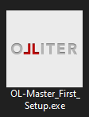
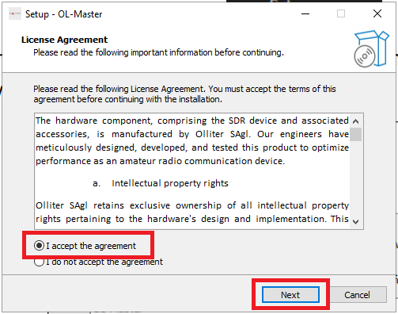
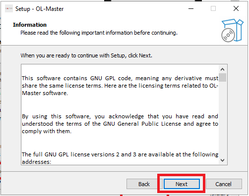
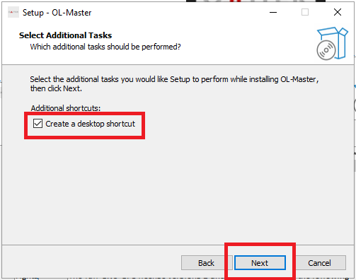
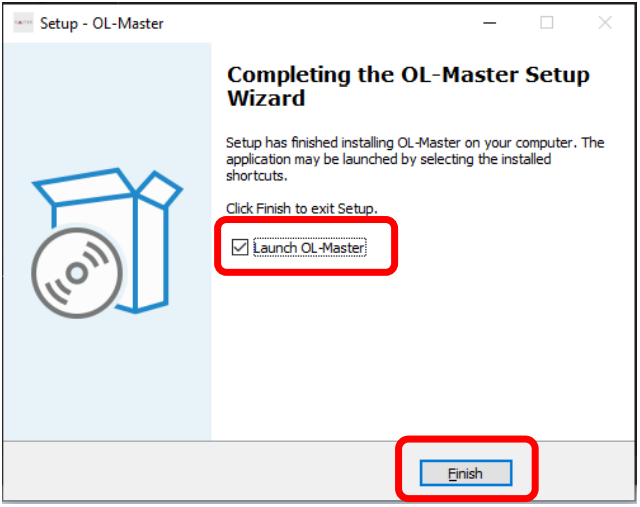

# OL-Master Software Setup Guide

Double click the executable to start the installer, administrative privileges are mandatory to install the software. Follow the on-screen instructions to proceed with the installation.

Please read carefully and accept all software license agreements to proceed with the installation.

Then read the hardware license agreement and accept it to proceed.

Optionally, tick the option to create a desktop shortcut for the software, this will create a shortcut on the desktop to quickly access the software. A start menu shortcut will be created automatically.

> [!TIP]
> During the update process, if any previous bandplan configuration files are detected, the installer will ask if you want to keep them or to replace them with the new default ones. If you have customized bandplans, it is recommended to keep the existing files.

Once the setup is completed, users can choose to start the software immediately or to close the installer. The software can be started later from the start menu or from the desktop shortcut if created.

Setup or update procedure is now completed, before starting the software, please read carefully the [next chapters](./README.md).
