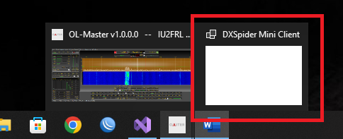

# OL-Master - Troubleshooting

This manual contains some issues that may occur while operating the transceiver, if the proposed solution does not work for you, please get in touch with the customer care department.

## Olliter SDR Not Powering Up

Some linear power supplies with large filtering capacitors can cause the Olliter SDR to power up improperly if it is connected before the power supply is turned on. This occurs because the slow charging process of the power supply\'s output filters triggers a low voltage alert in the transceiver, activating the protection circuit and cutting off the power.

**Solution**: Resetting the Protection Circuit

If the Olliter SDR does not show the green light when pressing the power button after turning on the power supply, follow these steps:

* Disconnect the Input Voltage

  * Ensure the power supply remains on.

  * Disconnect the input voltage from the Olliter SDR.

* Wait for a Few Seconds:

  * Allow a couple of seconds for the protection circuit to reset.

* Reconnect the Power:

  * Reconnect the input voltage to the Olliter SDR.

By following these steps, the protection circuit should reset, and the Olliter SDR should power up correctly. If the issue persists, ensure all connections are secure and the power supply is functioning correctly.

## OL-Master reporting an error at startup

If the OL-Master software throws an error at startup stating "Cannot load DLL 'ChannelMaster', cannot find the specified module" means that some dependencies are not satisfied.

**Solution**: Refer to the System requirements chapter and make sure all software and hardware requirements described in [OL-Master manual](./README.md) are met.

## Cannot connect to the OL-SDR transceiver

If you are unable to connect to the OL-SDR transceiver, the issue may be related to the Ethernet connection between the transceiver and your PC. Please check the following:

**Solution**: Follow these steps to troubleshoot the connection issue, potential issues might be related to duplicated IP addresses or network hardware capabilities.

### 1. Check for Duplicate IP Addresses

Ensure that no other device on your network is using the same IP address as the OL-SDR transceiver. Duplicate IP addresses will prevent proper communication.

### 2. Verify LAN Hardware Capabilities

All devices in the network path (PC, switches, routers) must support Gigabit Ethernet (1000 Mbps). Using older 10/100 Mbps adapters will not work at all.

### 3. Assign a Single IP Address

Make sure that only one IP address is assigned to the Ethernet interface used to control the transceiver. Multiple IPs on the same interface can cause routing conflicts.

### 4. Direct Connection Test

If the device still cannot be reached, try connecting the transceiver directly to your PC using a standard Ethernet cable, bypassing any switches or routers. This helps isolate network-related issues.

### 5. Additional Checks

* Confirm that the Ethernet cable is securely connected and undamaged.
* Ensure that the correct network adapter is selected in the OL-Master software.
* Disable any firewall or security software that may be blocking network traffic.

If you continue to experience issues after these steps, please contact customer care for further assistance.

## Something is not working as expected

If the OL-Master software starts behaving unexpectedly, or something is not working as expected, there might be a variety of reasons, to help diagnose the issue, please navigate to the `%appdata%/OL-Master/Logs` folder where the list of log files can be retrieved and forwarded to the customer care department if needed.

## OL-Master software crashed

If the OL-Master software crashes, it may be due to a variety of reasons, to help us diagnose the issue, please follow these steps:

* Navigate to the `%appdata%/OL-Master/Logs` folder
* Create a ZIP file containing all the files in the folder (all txt files and the `CrashDumps` folder)
* Send the ZIP file to the customer care department

The following additional details will help us diagnose the issue and provide a solution:

* The operating system version
* The hardware configuration of the PC
* The version of the OL-Master software
* The steps that led to the crash (or what was being done when the crash occurred)

## No voice from the front-panel microphone when transmitting

This issue can relate to multiple reasons, both software and hardware.

### VAC is enabled on the receiver

VAC will have priority over the microphone audio when transmitting, make sure the VAC is disabled on the current receiver from the Setup menu to enable the audio stream from the microphone.

**Solution**: disable VAC for the receiver that is being used

### Wrong microphone style

Each transceiver is shipped with a dedicated microphone wiring, a different brand of microphone cannot be used without switching to a new
wiring kit. Contact the customer assistance service to receive information on the wiring that was shipped with your transceiver or to request a new microphone wiring kit.

**Solution**: verify the microphone wiring that was installed

### Wrong microphone voltage

Different microphone brands have different settings, make sure the right microphone supply voltage was selected in the Setup menu.

**Solution**: verify the microphone supply voltage

### Improper microphone gain setting

Microphone gain is set from the upper-left panel of the OL-Master software when in SSB mode, adjust the slider to get a good quality of the transmitted audio.

Additional settings can be found in the Setup menu, like preamplifier or the adjustment range of the main slider.

**Solution**: verify the microphone gain.

## Additional windows (like EiBi or Cluster) are not showing up

Windows sometimes "hides" some UI elements outside the screen boundaries, just restore the window position to show it up.

**Solution**: Restoring the new window position

Hover the mouse to the OL-Master icon in the Windows bar (usually the bottom part of your screen), you should see two or more windows as in the picture

Right click on the window that has disappeared (the DX Spider Client in this example) and select "Maximize". The window should now appear on your main screen fully maximized, click on the title bar and drag it anywhere to return to its normal size. The new location should be stored in the database and recovered at the next reopening.

## User interface is not updating or feels slow

If the UI is laggy or unresponsive, it may be caused by a CPU overload, the bottom bar of OL-Master shows the CPU utilization, if this is too high, or even if the number is low but the interface feels "slow", please consider closing other software running in background or use a more powerful computer.

Another way to reduce the computing load of the software is to reduce the sample rate from the OL-Master "Setup" menu, closing additional receivers, turn off some advanced filtering (like NB2 or NR2) or disabling external services like cluster or EiBi.

Please remember that on SDR devices, the biggest part of the job is performed by the computer, so a powerful transceiver, requires an adequately powerful PC.

**Solution**: Reduce the sample rate, close all background applications or consider a PC hardware upgrade

## Audio from the speakers feels clicky or saturated

Audio levels is monitored by the AGC algorithm, if the AGC is set to any manual setting and the volume is too high, the audio will be saturated and sound bad.

**Solution**: lower the audio volume or enable AGC

## I connected the transceiver to a different PC and all settings were reset

Settings of the transceiver are not stored in the transceiver itself, they are stored in an xml file which lives in the `%appdata%/OL-Master` folder of the control PC. This file should be copied across the different devices where OL-Master is installed

**Solution**: copy the database file to the new PC

## I get a weird error at startup telling my database cannot be loaded for some reason

The database probably got corrupted due to some hardware or software issues, automatic backups are created by the software in the `%appdata%/OL-Master/Backups/Automatic` folder, these files can be copied back to `%appdata%/OL-Master` and renamed to `database.xml` to restore a previous configuration

**Solution**: restore one of the automatic backups of the database

## You can't stop using the Olliter SDR transceiver

We're glad that you got to this point, if you can't stop using the Olliter SDR, it means that our engineers have worked really hard to get the most out of the best hardware which is currently available on the market and you're enjoying the result. Please let's keep in touch with our team using the Olliter website [www.olliter.com](http://www.olliter.com) or our social media so you will be notified at every new software release or be the first one to test our new hardware.
