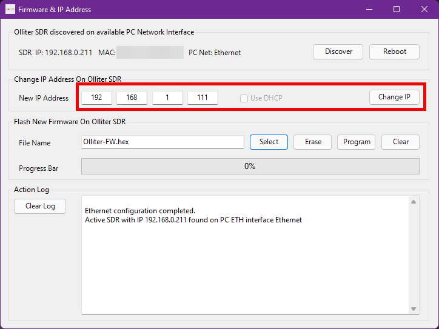

# Changing the IP address of the Olliter SDR

## Connect the device to the PC

Using a straight CAT5 Ethernet cable, connect the Olliter SDR to the PC (make sure the PC has an Ethernet interface that supports 1Gbps communication)

## Manually set the IP address of the PC

On the Windows PC, open Control Panel and select "Network and internet".

Select "Network and sharing"

Click on "Change adapter settings" on the left side.

Right click the Ethernet interface that was used to connect the SDR device and open the Properties menu.

Scroll down to select "Internet protocol version 4 (TCP/IPv4)" and then click on "Properties".

Click on the radio button to enable "Use the following IP address" and then input 192.168.1.10 as IP address and 255.255.255.0 as subnet mask. Leave default gateway and the DNS empty.

Click "Ok" on all dialogs to save the settings and execute OL-Master

## Setting the device address using OL-Master

Once the device is plugged, and the Ethernet interface is configured, turn on the transceiver and wait a couple of seconds for the device to initialize.

After executing the software, an error message will appear, informing the user that the connection to the device is not available, click OK to proceed.

If the dialog does not appear, it means that OL-Master was able to discover the device on the local network using UDP broadcast, this does not impact the procedure.

Once the software has started, click on the "FW Maintenance" menu on the top bar.

A dialog will appear listing the devices that were discovered on the local network, the Olliter SDR should show up, select it from the list.

In the central part of the dialog, type in the new IP address to be used by the device, the IP address must be valid on your local network and must not be used by any other device.

After inserting the IP address, click on Change IP to persist the settings to the device, the SDR should now reboot.

## Restore the default IP settings of the PC

Once the IP address of the transceiver is properly configured to a valid address, the master PC can be reconfigured to DHCP mode or the original IP address that was previously configured.

On the Windows PC, open Control Panel and select "Network and internet".

Select "Network and sharing"

Click on "Change adapter settings" on the left side.

Right click the Ethernet interface that was used to connect the SDR
device and open the Properties menu.

Scroll down to select "Internet protocol version 4 (TCP/IPv4)" and then
click on "Properties".

Restore the previous IP address settings as needed.

Now, please connect the Olliter SDR as shown in the Sample Ethernet connection of the SDR manual.
