# OL-SD20A SDR Transceiver User Manual


## Contents of this manual

1. [Contents of this manual](#contents-of-this-manual)

1. [Disclaimer for Proper Use of Amateur SDR Transceiver](#disclaimer-for-proper-use-of-amateur-sdr-transceiver)

    - [Proper Connection and Installation](#proper-connection-and-installation)

    - [Liability](#liability)

    - [Warranty and Damage](#warranty-and-damage)

    - [Electrostatic Discharge (ESD) Precautions](#electrostatic-discharge-esd-precautions)

    - [Safety and Compliance](#safety-and-compliance)

    - [Acknowledgement](#acknowledgement)

1. [Software license](#_Toc2034863503)

    - [License terms](#license-terms)

    - [Warranty disclaimer](#warranty-disclaimer)

    - [Obtaining the source code](#obtaining-the-source-code)

    - [Full GNU GPL version 3.0 license](#full-gnu-gpl-version-3.0-license)

    - [Contact information](#contact-information)

1. [Hardware license](#hardware-license)

    - [Intellectual property rights](#intellectual-property-rights)

    - [Warranty disclaimer](#warranty-disclaimer-1)

    - [Right to repair](#right-to-repair)

    - [Requesting hardware assistance](#requesting-hardware-assistance)

    - [License grant](#license-grant)

    - [Restrictions](#restrictions)

    - [Limitation of Liability](#limitation-of-liability)

    - [Indemnification](#indemnification)

    - [Termination](#termination)

    - [Governing law](#governing-law)

    - [Entire Agreement](#entire-agreement)

    - [Amendments](#amendments)

    - [Contact information](#contact-information-1)

1. [Important user notice](#important-user-notice)

1. [Introduction](#_Toc1360849860)

1. [Device overview](#device-overview)

    - [Front panel](#front-panel)

        - [Front panel LEDs](#front-panel-leds)

        - [Front speakers](#_Toc1852837891)

    - [Back panel](#back-panel)

    - [Connectors description](#connectors-description)

        - [Morse key jack](#morse-key-jack)

        - [Headphones output](#headphones-output)

        - [Microphone input](#microphone-input)

        - [Transverter interfaces](#transverter-interfaces)

        - [EXT IN](#ext-in)

        - [10MHz references](#mhz-references)

        - [PA Band connector](#pa-band-connector)

        - [ACC Connector](#acc-connector)

        - [OC connector](#oc-connector)

        - [Power connector](#power-connector)

        - [Antenna connectors](#antenna-connectors)

1. [System requirements](#system-requirements)

    - [Software requirements](#software-requirements)

        - [Operating system requirements](#operating-system-requirements)

        - [.NET 8](#net-8)

        - [Microsoft Visual C++ Redistributable](#microsoft-visual-c-redistributable)

    - [Hardware requirements](#hardware-requirements)

    - [Network requirements](#network-requirements)

1. [Installing OL-Master](#installing-ol-master)

1. [Wiring the transceiver](#wiring-the-transceiver)

    - [Connecting of the PureSignal cable](#connecting-of-the-puresignal-cable)

    - [Connecting the power supply](#connecting-the-power-supply)

    - [Connecting the antenna](#connecting-the-antenna)

    - [Ethernet connection](#ethernet-connection)

    - [Connecting the microphone](#connecting-the-microphone)

1. [Configuring the firewall](#configuring-the-firewall)

1. [Connection of the SDR to the PC](#connection-of-the-sdr-to-the-pc)

    - [Default Olliter SDR IP address](#default-olliter-sdr-ip-address)

    - [Sample Ethernet connection](#sample-ethernet-connection)

    - [Changing the Olliter SDR IP address](#changing-the-olliter-sdr-ip-address)

        - [Connect the device to the PC](#connect-the-device-to-the-pc)

        - [Manually set the IP address of the PC](#manually-set-the-ip-address-of-the-pc)

        - [Setting the device address using OL-Master](#setting-the-device-address-using-ol-master)

        - [Restore the default IP settings of the PC](#restore-the-default-ip-settings-of-the-pc)

1. [Usage of OL-Master](#usage-of-ol-master)

    - [Configuring OL-Master](#configuring-ol-master)

        - [Configuring the Olliter SDR address](#configuring-the-olliter-sdr-address)

        - [Configuring the operator settings](#configuring-the-operator-settings)

        - [Configuring the audio interface](#configuring-the-audio-interface)

        - [Configuring the receiver bandwidth](#configuring-the-receiver-bandwidth)

        - [Configuring the refresh rate](#configuring-the-refresh-rate)

    - [Starting the device](#starting-the-device)

    - [Controlling the transceiver](#controlling-the-transceiver)

        - [Selecting a different band](#selecting-a-different-band)

        - [Tuning a frequency](#tuning-a-frequency)

        - [Setting the visualization mode](#setting-the-visualization-mode)

        - [Interacting with the spectrum](#interacting-with-the-spectrum)

        - [Setting the receiver mode](#setting-the-receiver-mode)

        - [Adding additional receivers](#adding-additional-receivers)

        - [Adjusting the receivers volume](#adjusting-the-receivers-volume)

        - [DSP options](#dsp-options)

    - [Firmware upgrade](#firmware-upgrade)

1. [General recommendations](#general-recommendations)

    - [Digital modes (FT8)](#digital-modes-ft8)

        - [Using Virtual Audio Cable (VAC)](#using-virtual-audio-cable-vac)

        - [Audio Levels and Filters](#audio-levels-and-filters)

        - [Transmit and Receive Filters](#transmit-and-receive-filters)

    - [SSB mode](#ssb-mode)

        - [Microphone Voltage Considerations](#microphone-voltage-considerations)

        - [Switching from FT8 to SSB](#switching-from-ft8-to-ssb)

        - [Audio Processing Settings for SSB](#audio-processing-settings-for-ssb)

        - [Transmitting Filter Settings](#transmitting-filter-settings)

1. [Troubleshooting](#troubleshooting)

    - [Olliter SDR Not Powering Up](#olliter-sdr-not-powering-up)

    - [OL-Master reporting an error at startup](#ol-master-reporting-an-error-at-startup)

    - [No voice from the front-panel microphone when transmitting](#no-voice-from-the-front-panel-microphone-when-transmitting)

        - [VAC is enabled on the receiver](#vac-is-enabled-on-the-receiver)

        - [Wrong microphone style](#wrong-microphone-style)

        - [Improper microphone gain setting](#improper-microphone-gain-setting)

    - [Additional windows (like EiBi or Cluster) are not showing up](#additional-windows-like-eibi-or-cluster-are-not-showing-up)

    - [User interface is not updating or feels slow](#user-interface-is-not-updating-or-feels-slow)

    - [Audio from the speakers feels clicky or saturated](#audio-from-the-speakers-feels-clicky-or-saturated)

    - [I connected the transceiver to a different PC and all settings were
reset](#i-connected-the-transceiver-to-a-different-pc-and-all-settings-were-reset)

    - [I get a weird error at startup telling my database cannot be loaded
for some reason](#i-get-a-weird-error-at-startup-telling-my-database-cannot-be-loaded-for-some-reason)

    - [You can't stop using the Olliter SDR transceiver](#you-cant-stop-using-the-olliter-sdr-transceiver)

1. [Additional resources](#_Toc1091918595)

    - [Olliter website](#olliter-website)

    - [Olliter YouTube channel](#olliter-youtube-channel)

    - [Olliter on Facebook](#olliter-on-facebook)

    - [Olliter on Instagram](#olliter-on-instagram)

## Disclaimer for Proper Use of Amateur SDR Transceiver

> [!WARNING]
> Please read carefully before using the SDR transceiver

### Proper Connection and Installation

The connection and installation of the SDR transceiver are the sole
responsibility of the user. It is crucial that all connections are made
by the user in accordance with industry standards and best practices to
ensure the safety and proper functionality of the equipment.

### Liability

*Olliter SAgl* shall not be held liable for any damages resulting from the
improper use or incorrect installation of the SDR transceiver, whether
such damages occur to the user or any third parties. This includes, but
is not limited to, physical damage to the equipment, loss of data, or
any other consequential damages.

### Warranty and Damage

In the event of equipment damage, if it is determined that the cause of
damage was improper use or incorrect connection by the user, Olliter
SAgl will not honor any warranty claims. Users are strongly encouraged
to follow all usage instructions and safety guidelines to prevent
voiding the warranty.

### Electrostatic Discharge (ESD) Precautions

Users must take appropriate precautions to protect the SDR transceiver
from electrostatic discharge (ESD). Failure to implement ESD protection
measures can result in permanent damage to the device. ESD precautions
include, but are not limited to, using an ESD wrist strap when handling
connectors or any interface of the device, properly grounding all
equipment, and working on an ESD-safe surface.

### Safety and Compliance

Users must ensure that their use of the SDR transceiver complies with
all local laws and regulations. This includes adhering to frequency
allocation rules, power output restrictions, and any other regulatory
requirements pertaining to the operation of amateur radio equipment.

### Acknowledgement

By using the SDR transceiver, you acknowledge that you have read and
understood this disclaimer and agree to comply with all guidelines and
precautions outlined herein. Failure to do so may result in equipment
damage, legal consequences, or personal injury, for which OLLITER will
not be responsible.

### Software license

This software contains GNU GPL code, meaning any derivative must share
the same license terms. Here are the licensing terms related to
OL-Master software.

By using this software, you acknowledge that you have read and
understood the terms of the GNU General Public License and agree to
comply with them.

The full GNU GPL license versions 2 and 3 are available at the following
addresses:

- <https://www.gnu.org/licenses/old-licenses/gpl-2.0.html>

- <https://www.gnu.org/licenses/gpl-3.0.html>

Terms of this license are also reported in the Full GNU GPL version 3.0
license chapter.

#### License terms

This software, OL-Master, is derived from PowerSDR. The original
PowerSDR software and our derived version are distributed under the
terms of the GNU General Public License (GPL), version 2, or any later
version as published by the Free Software Foundation.

Under the terms of the GPL, you are granted the following rights:

- Freedom to Use: You may use this software for any purpose.

- Freedom to Study and Modify: You may study how the program works and modify it to suit your needs. Access to the source code is a precondition for this freedom.

- Freedom to Distribute Copies: You may redistribute copies of the original program so you can help others.

- Freedom to Distribute Modified Versions: You may distribute copies of your modified versions to others under the same license. By doing this, you can give the whole community a chance to benefit from your changes.

#### Software warranty disclaimer

This program is distributed in the hope that it will be useful, but
WITHOUT ANY WARRANTY; without even the implied warranty of
MERCHANTABILITY or FITNESS FOR A PARTICULAR PURPOSE. See the GNU General
Public License for more details.

#### Obtaining the source code

In compliance with the GPL, the complete corresponding source code for
this software is available. The source code includes all the necessary
files to compile, install, and run the software, as well as any
modifications and enhancements we have made.

To obtain the source code, a written offer should be performed, you can
request it by sending a written request to the following address:

```txt
Olliter Laboratory SAgl
Amsler 1,
CH-7304 Maienfeld
```

Or, via email at the following address: <legal@olliter.com>

To comply with the GNU/GPL license, this offer is valid for three years
from the date you received the binary version of the software.

*Olliter SAgl* is committed to providing optimal user experience and is
currently exploring additional methods for distributing the source code,
such as through version control platforms, online file-sharing services,
or on the Olliter website. While these options are not yet available, we
will inform our users as soon as they are implemented.

#### Full GNU GPL version 3.0 license

Please see: [GNU General Public License v3.0](https://www.gnu.org/licenses/gpl-3.0.html)

### Hardware license

The hardware component, comprising the SDR device and associated
accessories, is manufactured by *Olliter SAgl*. Our engineers have
meticulously designed, developed, and tested this product to optimize
performance as an amateur radio communication device.

#### Intellectual property rights

*Olliter SAgl* retains exclusive ownership of all intellectual property
rights pertaining to the hardware\'s design and implementation. This
agreement grants you a limited license to use the hardware, but
ownership remains with *Olliter SAgl*.

#### Hardware warranty disclaimer

*Olliter SAgl* offers a limited warranty covering manufacturing defects.
The warranty period aligns with applicable consumer protection laws in
your jurisdiction. For precise warranty details, please consult the
consumer protection regulations in your country of residence.

This warranty does not encompass damages resulting from misuse,
accidents, unauthorized modifications, or ordinary wear and tear
(including but not limited to knobs, switches, and fuses).

#### Right to repair

In compliance with EU regulations, *Olliter SAgl* will provide spare parts
and repair manuals for a minimum of two years post-product
discontinuation or until component availability from our supplier\'s
ceases. We are committed to exploring alternative repair solutions
during this period.

While federal Right to Repair legislation may not exist in all non-EU
countries, certain states have enacted their own laws. *Olliter SAgl* will
adhere to applicable Right to Repair regulations in our markets. Our aim
is to empower users with the necessary information and resources to
maintain device functionality for an extended period.

#### Requesting hardware assistance

To report a defect, please contact <hello@olliter.com> for technical
support or authorized repair center information.

#### License grant

*Olliter SAgl* grants you a non-exclusive, non-transferable, limited
license to use the hardware solely for its intended purpose as outlined
in the accompanying documentation. This license includes the right to:

- Access and repair the hardware using readily available tools and
    parts.

- Seek repair services from independent repair shops in addition to
    *Olliter SAgl*\'s authorized service providers.

#### Restrictions

By utilizing the Olliter SDR transceiver, you agree to:

- Refrain from reverse engineering the hardware for purposes other
    than repair or security research (unless authorized in writing by
    *Olliter SAgl*).

- Avoid modifying, adapting, or creating derivative works based on the
    hardware that infringe upon *Olliter SAgl*\'s intellectual property
    rights.

- Preserve all proprietary notices and labels on the hardware.

#### Limitation of Liability

To the fullest extent permitted by law, *Olliter SAgl* shall not be held
liable for any indirect, incidental, special, consequential, or punitive
damages, including but not limited to loss of profits, revenues, data,
use, goodwill, or other intangible assets, arising from:

- Our use or inability to use the hardware.

- Unauthorized use or alteration of the hardware.

- Other hardware-related issues (including but not limited to static
    discharge, improper external device connections, fire, or
    weather-related incidents).

#### Indemnification

You agree to indemnify and hold harmless *Olliter SAgl* from any claims,
liabilities, damages, losses, expenses, including reasonable attorney
fees, arising from your hardware use or agreement violations.

#### Termination

This agreement remains in effect until terminated by either party. Your
failure to comply with agreement terms automatically terminates your
rights without notice. Upon termination, you must cease all hardware use
and destroy accompanying documentation.

#### Governing law

Swiss law governs this agreement, excluding conflict of law principles.
Any legal disputes arise exclusively in Swiss courts.

#### Entire Agreement

This agreement constitutes the entire understanding between you and
*Olliter SAgl* regarding hardware use, superseding all prior or
contemporaneous agreements (written or oral).

#### Amendments

*Olliter SAgl* reserves the right to modify this agreement with prior
notice. Continued hardware use post-amendment implies acceptance of the
revised terms.

### Contact information

If you have any questions about this hardware agreement, please contact:

```txt
Olliter Laboratory SAgl
Amsler 1,
CH-7304 Maienfeld
```

Or, via email at the following address: [legal@olliter.com](mailto:legal@olliter.com)

## Important user notice

This radio is designed to comply with your country\'s radio regulations.
It operates on frequencies allocated exclusively for amateur radio use.
To legally operate this radio, you must possess a valid amateur radio
license of the appropriate class issued by your government.

Radio frequency (RF) emissions from transmitters can potentially
interfere with electronic devices, including pacemakers and
defibrillators. If you suspect any interference with your medical device
while operating this radio, immediately cease transmission and seek
medical attention if necessary.

## Introduction

The main purpose of this guide is to help you configuring for the first
time your Olliter SDR Transceiver.

This guide may not fully cover the hardware configuration of the device
or every feature available on the software, it will cover the first
steps to connect the SDR transceiver, receive and transmit.

## Device overview

This chapter covers the input and output of the Olliter SDR transceiver
to guide the user when interfacing with external devices.

### Front panel

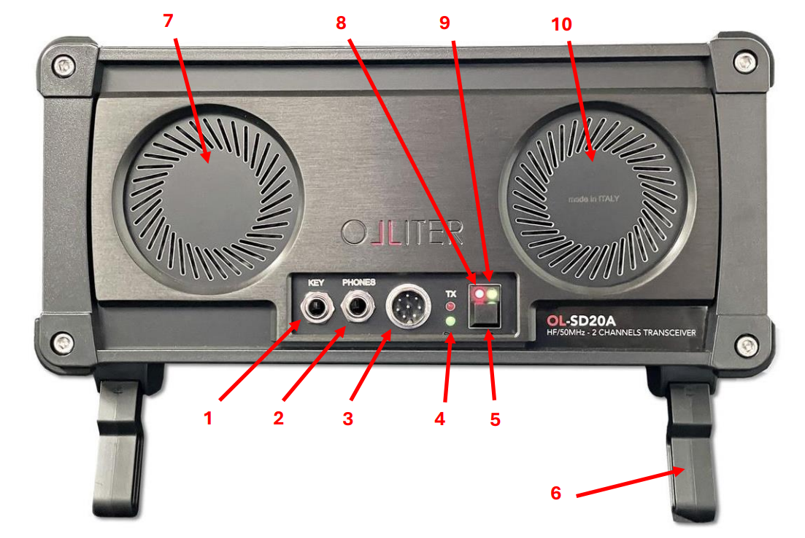

1. Morse key input

2. Headphones output

3. Microphone input

4. Connection LED

5. Power button

6. Adjustable legs

7. Left speaker

8. Standby LED

9. Power-on LED

10. Right speaker

#### Front panel LEDs

The front panel offers four different LEDs, each LED have a different
meaning

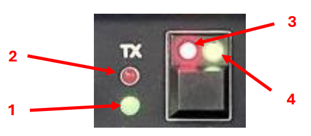

1. Connection status: this LED is ON when OL-Master is communicating with the transceiver

2. Transmission: this LED is ON when the device is transmitting

3. Stand-by: this LED is ON when voltage is applied to the device

4. Power-on: this LED is ON when the power button is pressed and stays
    on when the device is operating (even if not communicating with
    OL-Master)

If the Power-on LED is not turning on when pressing the power button,
please refer to the Troubleshooting chapter of this manual

- []{#_Toc1852837891 .anchor}Front speakers

These speakers are controlled by OL-Master and can be used to play the
demodulated signal that is tuned. The onboard speakers can be enabled or
disabled from OL-Master, volume control is also provided by the software

### Back panel

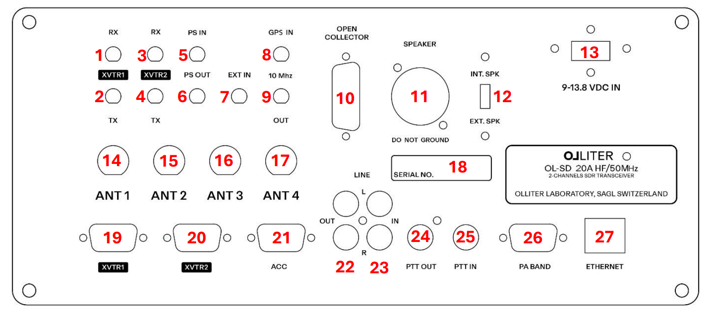

1.  Receiving line for the transverter interface 1

2.  Transmitting line for the transverter interface 1

3.  Receiving line for the transverter interface 2

4.  Transmitting line for the transverter interface 2

5.  Pure signal input

6.  Pure signal output

7.  EXT IN (unfiltered RF input)

8.  10MHz input from an external oscillator (GPSDO or rubidium
    reference)

9.  10MHz output for external devices (such as transverters)

10. Open collector I/O (can be configured from OL-Master)

11. Speaker connection (high power output, designed for external 8-ohm
    speakers)

12. Internal or external speaker selector

13. Power supply input (13.8V DC)

14. Antenna 1 receiving and transmitting connector

15. Antenna 2 receiving and transmitting connector

16. Antenna 3 receiving and transmitting connector

17. Antenna 4 receiving and transmitting connector

18. Serial number location

19. Transverter 1 interface (digital inputs and outputs to control
    external transverters)

20. Transverter 2 interface (digital inputs and outputs to control
    external transverters)

21. External accessories interface (digital inputs and outputs)

22. RCA audio output (low power output, to be sent to the line-in of
    external audio devices)

23. RCA audio input (low power input, to be used as transmitting audio
    line)

24. Open collector PTT output

25. External PTT input (active low)

26. Band output (digital output)

27. Ethernet interface (1Gbps only)

#### Connectors description

Here is a description of the inputs and outputs of the Olliter SDR
transceiver. Some of these connections are highly sensitive to ESD,
overvoltage, short-circuit, overcurrent and more, please take all the
recommended measures when connecting external devices.

> [!WARNING]
> The warranty for your Olliter SDR device will be voided if our customer assistance department determines that the device has been damaged or rendered inoperative due to improper connection of external devices.


> [!WARNING]
> The warranty for your Olliter SDR will be voided if our customer assistance department determines that the device has been damaged or rendered inoperative due to connection of external devices that generate or absorb excessive current or voltage

#### Morse key jack

This ¼ inch (6.35mm) jack is used to connect either a paddle or a straight key. When using a paddle, the DOT and DASHES can be swapped from the CW menu of OL-Master settings.

This connector uses either 5V or 3V3 pull-up resistors. Voltage can be selected by moving the internal "3.3 -- 5V I/O" jumper.

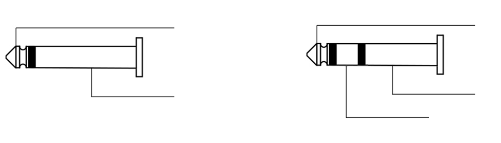

#### Headphones output

This output is designed to drive standard headphones with a nominal
impedance of 16Ω impedance, output level is 50mW for a -75dB THD.

> [!WARNING]
> Prolonged use of headphones at high volume can cause permanent hearing dagame. Adjust the volume to a safe level to protect your ears.

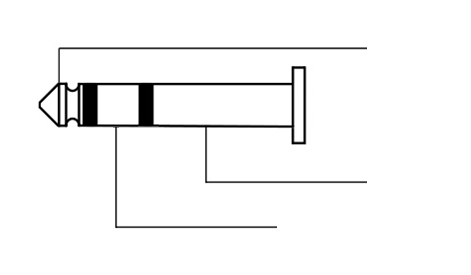

#### Microphone input

> [!WARNING]
> If the transceiver was ordered with a Icom wiring, a Yaesu microphone cannot be used and vice-versa. Using a different microphone style can damage the transceiver and/or the microphone.

This input should be chosen when placing the order for the Olliter SDR transceiver. This input is designed to work with either Icom (such as the SM-30) or Yaesu (such as M-70) microphones.

In addition to the microphone wiring that was requested, and independently from the user choice, a balanced input for a dynamic capsule is also available on the same connector.

> [!WARNING]
> Before connecting any kind of microphone to the transceiver, please adjust the voltage settings in the Setup menu of OL-Master software. Incorrect voltage settings may damage the transceiver and/or the microphone.

Selection between 5V, 8V or none can be toggled in the Setup menu of OL-Master.

Advanced features (like up/down, scan, etc.) are not available.

| Pin | Transceiver (Icom Wiring)       | Icom SM-30 Dynamic Microphone |
|-----|--------------------------------|------------------------------|
| 1   | Microphone signal             | Balanced input +             |
| 2   | +8V microphone power          | N.C.                         |
| 3   | N.C.                           | N.C.                         |
| 4   | N.C.                           | Balanced input -             |
| 5   | PTT signal                     | PTT signal                   |
| 6   | PTT GND                        | PTT GND                      |
| 7   | Microphone GND                 | GND                          |
| 8   | N.C.                           | N.C.                         |

| Pin | Transceiver (Yaesu Wiring)      | Yaesu M-70 Dynamic Microphone |
|-----|--------------------------------|------------------------------|
| 1   | N.C.                           | N.C.                         |
| 2   | +5V microphone power           | N.C.                         |
| 3   | N.C.                           | N.C.                         |
| 4   | N.C.                           | Balanced input -             |
| 5   | PTT GND                        | PTT GND                      |
| 6   | PTT Signal                     | PTT Signal                   |
| 7   | Microphone GND                 | GND                          |
| 8   | Microphone signal              | Balanced input +             |

*Icom and the Icom logo are registered trademarks of Icom Incorporated (Japan)*

*Yaesu and the Yaesu logo are registered trademarks of Yaesu Musen Co., Ltd.*

#### Transverter interfaces

The transverter input and outputs are designed to drive external devices
to provide additional bands to the transceiver.

The transverter input 1 is connected to the CH1 line of the SDR, while
the transverter input 2 is connected to the CH2 line of the SDR. Both
inputs are passed through a dedicated 50MHz low-pass filter, a 32dB
software-controlled attenuator and a 20dB amplifier. The suggested
maximum input should be -2dBm (assuming no attenuator is used).

The nominal output for the transverter transmission line is 10dBm, this
value may vary a little depending on the IF frequency that is
configured. The transmission signal is passed through a 50MHz low-pass
filter, and a programmable attenuator (which is controlled by the TX
Power slider in OL-Master).

Transverters can be configured using the dedicated section of the
OL-Master software.

#### EXT IN

> [!WARNING]The EXT IN connector provide direct access to the ADC2 device
> inside the transceiver, excessive power input can permanently
> damage the internal circuits

This input provides an unfiltered path to the CH2 line of the
transceiver, it is typically used to interface with external devices
where filters are already installed (such as panadapter interfaces).

To enable this feature please select RX2 as receiver channel for the
receiver that is going to be used.

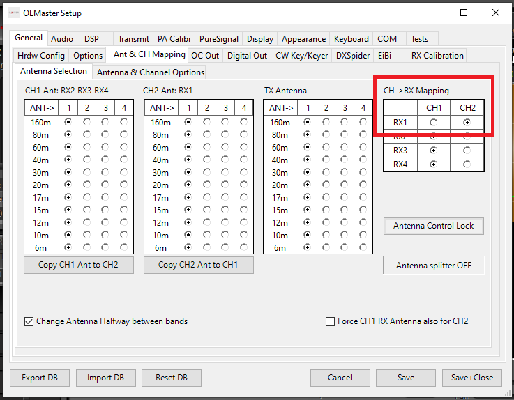

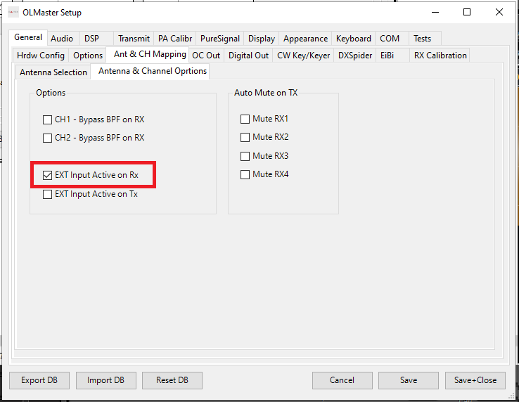

#### 10MHz references

The Olliter SDR transceiver can be connected to an external 10MHz
reference to provide better frequency stability, this is very convenient
when working with high-frequency devices like microwave transverters.

The 10MHz input (labelled as GPS IN) is a 50Ω input between -15dBm and
+5dBm. This input is protected against overvoltage but using an
attenuator (if needed) is recommended.

The 10MHz output (labelled as OUT) provides a 3.3V CMOS output with a
series resistance (used as short-circuit protection). This output can
only be used as a frequency reference, and it was not designed to
provide more than 20mA. This output comes from the internal TCXO when no
external reference is applied.

#### PA Band connector

This connector offers some digital outputs that can be used to drive external antenna switches or amplifiers.

These outputs can be programmed by the user using the Setup menu of OL-Master.

These outputs are normally in a LOW state using a pull-down resistor.

The voltage that is provided by this port depends on the internal "3.3 -- 5V I/O" jumper. Maximum available current is limited with a 220Ω series resistor.

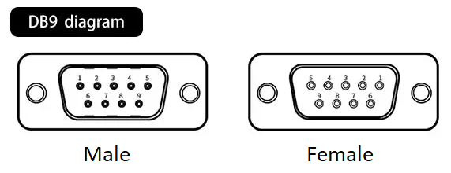

| DB9 Pin | Software Output  |
|---------|-----------------|
| 1       | Digital out 1   |
| 2       | Digital out 2   |
| 3       | Digital out 3   |
| 4       | Digital out 4   |
| 5       | GND            |
| 6       | Digital out 5   |
| 7       | Digital out 6   |
| 8       | Digital out 7   |
| 9       | Digital out 8   |

#### ACC Connector

This connector offers some inputs to control several features of the
SDR, such as PTT controls for RX2, RX3 and RX4, an external inhibit
line, and two additional analog inputs that can be used to get
information from external devices (like temperature probes or flow
meters).

The voltage that can be applied to the digital input port depends on the
internal "3.3 -- 5V I/O" jumper. In any case, it should never exceed the
configured voltage.

| State       | 3.3V I/O Range | 5V I/O Range  |
|------------|---------------|--------------|
| Low state  | 0V to 0.8V    | 0V to 1.5V   |
| High state | 2V to 3.3V    | 3.5V to 5V   |

The voltage range for both ADC0 and ADC1 is 0V to 3.3V. Excessive
voltage can cause severe damage to the ADC circuitry.

Pins 6 and 8 have an internal 4.7KΩ pull-up resistor, while pins 7 and 9
have an internal 4.7KΩ pull-down resistor.


| DB9 Pin | Software Output           |
|---------|---------------------------|
| 1       | GND                        |
| 2       | N.C.                       |
| 3       | ADC in 1                   |
| 4       | ADC in 0                   |
| 5       | GND                        |
| 6       | PTT RX2 (active LOW)       |
| 7       | PTT RX4 (active HIGH)      |
| 8       | PTT RX3 (active LOW)       |
| 9       | Ext Inhibit (active HIGH)  |


#### OC connector

This connector offers 8 open-collector outputs that can be used to drive
external accessories like power amplifiers or antenna relays.

The maximum V~CE~ that can be used at the open-collector outputs is 48V
DC.

The 13.8V DC lines are derived from the main power supply and are
protected by a 250mA resettable fuse.

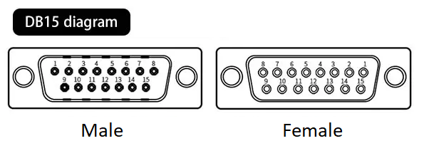

| DB15 Pin | Software Output          |
|----------|--------------------------|
| 1        | GND                      |
| 2        | OUT 2                    |
| 3        | OUT 4                    |
| 4        | OUT 6                    |
| 5        | OUT 8                    |
| 6        | GND                      |
| 7        | GND                      |
| 8        | 13.8V                    |
| 9        | OUT 1                    |
| 10       | OUT 3                    |
| 11       | OUT 5                    |
| 12       | OUT 7                    |
| 13       | Open-collector common    |
| 14       | GND                      |
| 15       | 13.8V                    |


External relay connection example:

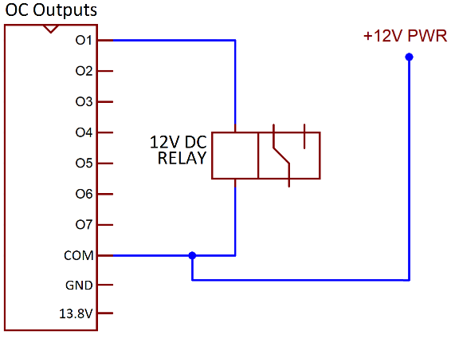

#### Power connector

Please refer to the Connecting the power supply chapter for further
information

#### Antenna connectors

These four BNC connectors are used by the transceiver to receive and
transmit. Different bands can receive or transmit on different antennas,
mapping between bands, mode and antenna can be done in the Setup menu of
OL-Master.

Please refer to the Connecting the antenna for further information

## System requirements

An SDR transceiver requires a control device to work, the hardware of
the transceiver is used to convert analog RF signals to an IQ stream
that is sent to a software installed on the control device, where it is
processed to extract an audio signal. When transmitting, the process is
reversed. The hardware and software need to work together to receive and
transmit signals using the SDR transceiver.

Some I/O are available on-board to interface with external accessories
like microphones, headphones and Morse key or paddle.

A simplified schematic representation of the SDR device is shown below.


### Software requirements

As any SDR device, one of the main components is the PC that is used to
control the device, the same PC is also used to decode and process the
raw digital stream of data to usable audio stream. This decode process
requires some minimum software and hardware requirements that should be
met.

#### Operating system requirements

The OL-Master application was developed for Microsoft Windows 10 or later. Virtualization of such operating systems is also supported, if the host machine is capable enough.

Compatibility with Microsoft Windows 8.1 or previous versions of Microsoft Windows cannot be ensured due to lack of support for the latest .NET modules which was used to develop the application.

#### .NET 8

The operating system should be updated to the latest version and the .NET8 must be installed on the machine (latest update of the .NET8 can be downloaded from the Microsoft).

Depending on the system configuration, both the .NET8 SDK and .NET8 Runtime might be needed.

- .NET8 Link: <https://dotnet.microsoft.com/it-it/download/dotnet/thank-you/runtime-desktop-8.0.13-windows-x64-installer>
- .NET8 SDK Link: <https://dotnet.microsoft.com/it-it/download/dotnet/thank-you/sdk-8.0.406-windows-x64-installer>

#### Microsoft Visual C++ Redistributable

Some components of the software were written using highly optimized C++ code, this requires the latest version of the Microsoft Visual C++ Redistributable package to be installed and updated. The latest version of this package can be downloaded from the following URL:

- VC Redist: <https://learn.microsoft.com/it-it/cpp/windows/latest-supported-vc-redist?view=msvc-170>
.

As per the moment this manual was written, the latest available version
is 14.40.33810.0.

### Hardware requirements

Recommended hardware setup is an 7^th^ generation Intel Core i5 or later, with at least 16GB of RAM and 1GB of available storage space (disk usage may vary depending on additional features like recordings, cluster, EIBI and more).

Ethernet interface at 1Gbps on the control PC is mandatory if using more than one receiver window. Ethernet interface at 1Gbps is mandatory to configure the IP address of the device if connected directly to the control PC.

### Network requirements

An ethernet interface capable of 1Gbps **is mandatory** for the transceiver to communicate with the control device (PC), a properly configured ethernet switch with interfaces at 1Gbps is suggested to be used in between the SDR and the PC.

Please note, the transceiver **does not support negotiating any speed lower than 1Gbps** with the control device or the switch/router that is plugged into.

An ethernet cable CAT5 or superior is highly recommended to interface the SDR to the switch/router and the PC.

To ensure best performances, use high quality switch or router and cables, make sure the whole network from the SDR to the master PC is capable of continuously communicate at 1Gbps.

An internet connection is not required if not using external services (like clusters or EIBI).

A network connection diagram is available at the [Sample Ethernet connection](#Sample Ethernet connection) chapter.

## Installing OL-Master

After buying an Olliter SDR, you should receive the setup file for
OL-Master, this is the main application that controls the SDR and must
be installed on the PC.


Double click the executable to start the installer, administrative
privileges are mandatory to install the software. Follow the on-screen
instructions to proceed with the installation.

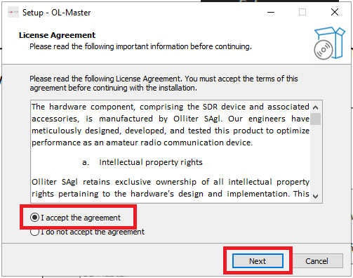


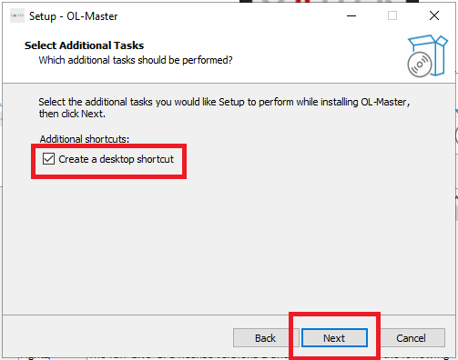

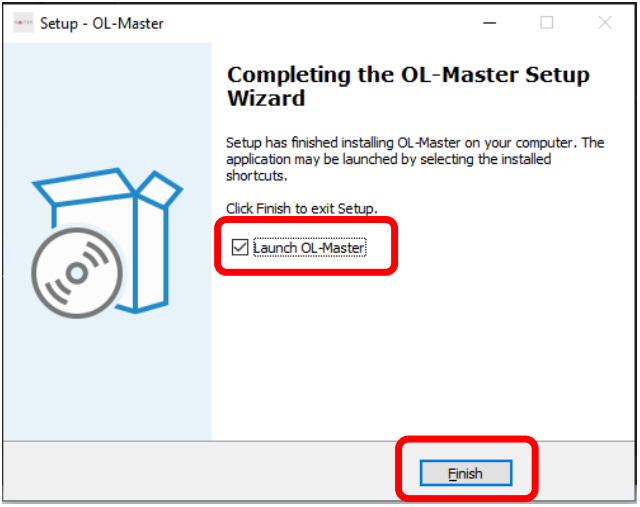

Setup is now completed, before starting the software, please read carefully the next chapter.

### Configuring the firewall

Network communication to the device is performed using UDP protocol, a
security system exception must be created for the software to work
reliably.

Open the Windows firewall settings.


Select "Inbound connection rules" on the left menu.

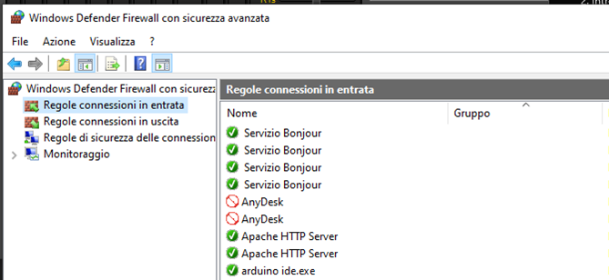

Click on "New rule" on the right menu.


Select \"Program" and click "next".


Click on "Browse" and navigate to "C:\\Program
Files\\Olliter\\Ol-master.exe"


Click on "Next"


Select "Allow connections" and click "Next".


Now select the kind of network that you are using, by default it should
be "Private", if you are using a different kind of network, please
select the option that best fits your configuration.


Insert any name you like and then click on "Complete".


## Wiring the transceiver

> [!WARNING]
> Electrostatic Discharge (ESD) can cause severe damage to electrical circuits, potentially leading to costly repairs or replacements. Always take measures to protect your equipment. These safety measures include but are not limited to:
>
> - Proper grounding: make sure all equipment and workstations are properly grounded
> - Avoid static-inducing clothing: avoid wearing synthetic materials that generate static electricity  
> - Handle components with care: touch components only by their edges or the grounding case avoiding touching pins and circuitry

Connecting the transceiver is simple but a couple of considerations and
safety measures are needed, please read carefully the wiring
instructions to prevent damages to the Olliter SDR.

### Connecting of the PureSignal cable

To achieve optimal transmission quality and reduce the spurious
emissions, the Pure Signal technology is supported by the Olliter SDR
transceiver.

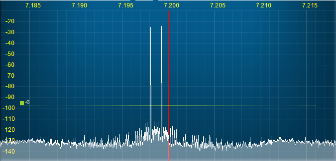

Pure Signal is the name given to the theory and implementation of the 
clean transmission logic developed by the OpenHPSDR team and implemented
in both the Olliter SDR software and transceiver. The algorithm behind
the Pure Signal technology is quite simple, when both the drive applied
to the Digital-to-analogue converter (DAC) and the output as measured at
the antenna are known it is possible to modify the drive so that the
output is as clean as possible.

The Pure Signal technology is enabled by connecting the PS IN with the
PS OUT using the provided SMA to SMA coaxial cable.

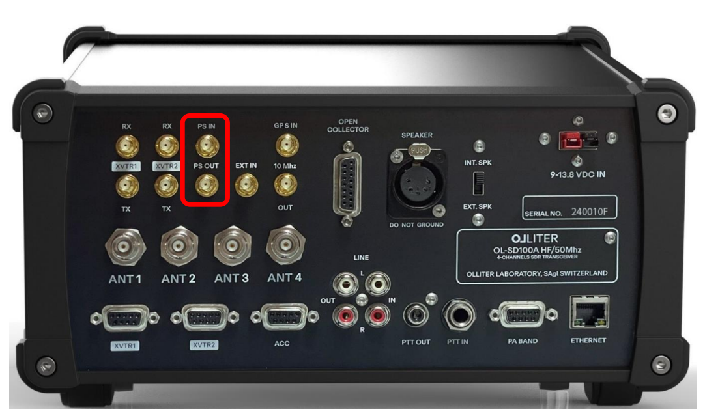

### Connecting the power supply

The Olliter SDR was designed to operate from a stable and constant power
supply which is capable of continuously delivering 13.8V at 5A for the
20W model.

An integrated protection circuit is added to the transceiver which can
help in protecting the radio from excessive voltage fluctuations by
cutting the power line and turning off the device.

> [!WARNING]The integrated protection circuit should not be considered a
> surge, lightning or electrostatic protection, it was designed to
> protect the circuitry from excessive or low voltages which may
> negatively impact the transceiver performances.

Connect the power supply to the Olliter SDR by using high-quality
Anderson PowerPole® connectors. Wire size should be chosen according to
the length of the connection, here are our suggestions:

- Wires shorter than 2 meters (6.5ft) long will require 2mm^2^ (AWG14) wires

- Wires between 2 and 4 meters (6.5ft to 13ft) will require 4mm^2^ wires

- Wires longer than 4 meters (13ft) are not recommended as they may
    pick up excessive noise from the surrounding environment or cause
    excessive voltage fluctuations

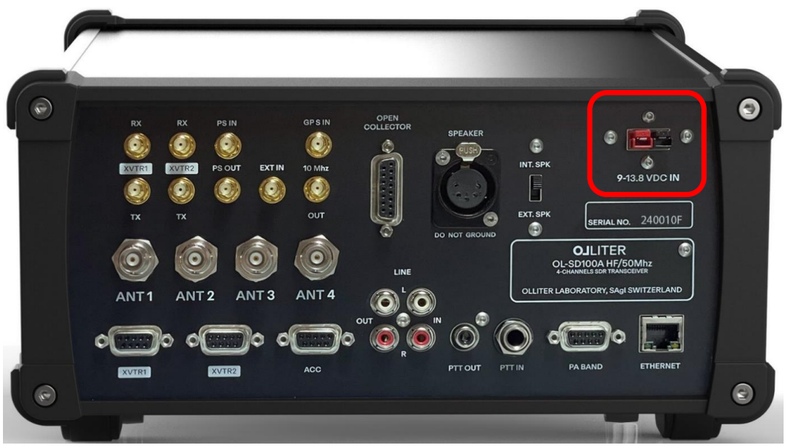

Make sure to connect all the needed wires before turning on the power
supply.

If the transceiver does not show the red (standby) light after applying
power, please refer to the Troubleshooting chapter.

### Connecting the antenna

Up to 4 antennas can be connected to the Olliter SDR, these can be
configured in software to allow receiving and transmitting on different
bands with different antennas.

To begin, connect an antenna using a male BNC connector to the ANT1
socket.

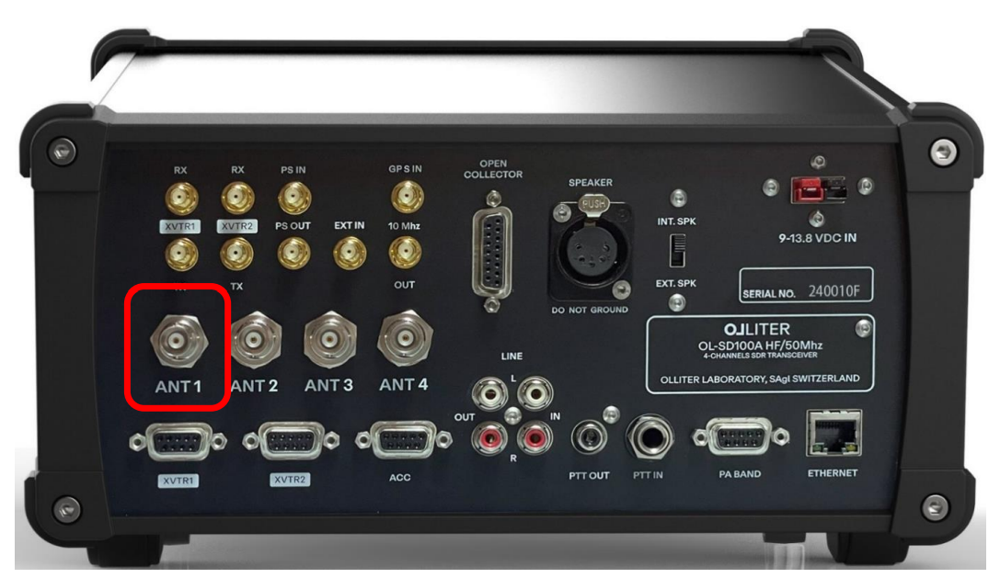

### Connecting the ethernet cable

To interface the transceiver with the local network, please refer to the
Connection of the SDR to the PC chapter of this manual.

### Connecting the microphone

Each device comes with a dedicated microphone wiring which should be
selected when ordering the transceiver, use the front 8-pin socket to
connect the microphone.


## Connection of the SDR to the PC

Connection of the transceiver to the PC is performed using an
Ethernet/IP protocol, make sure to use high quality network equipment
and cables to achieve best results.

### Default Olliter SDR IP address

The transceiver comes with a preconfigured IP address set to
192.168.1.111, if this address is valid on your local network (meaning
your local network has an address family like 192.168.1.X and the subnet
mask is 255.255.255.0), you can just plug the device to the local
network and skip the IP address setup guide.

  
> [!WARNING]Before applying any voltage to the SDR, connect the device to
  your home switch/router using a high-quality CAT5 (or superior)
  ethernet cable
  

  

  
> [!WARNING]The transceiver can only communicate at 1Gbps, if the
  switch/router or the master PC does not support such speed, the
  connection may be unavailable or unstable
  

  

### Sample Ethernet connection

The following schematic illustrates the recommended connection of the
SDR device to the PC.

> {width="5.357465004374453in"
> height="2.8049146981627295in"}

### Changing the Olliter SDR IP address

Management of the IP address is performed using OL-Master, if the
default IP address (192.168.1.111) is not valid or available on your
local network, follow this procedure to change it to a valid one.

#### Connect the device to the PC

Using a straight CAT5 Ethernet cable, connect the Olliter SDR to the PC
(make sure the PC has an Ethernet interface that supports 1Gbps
communication)


#### Manually set the IP address of the PC

On the Windows PC, open Control Panel and select "Network and internet".


Select "Network and sharing"


Click on "Change adapter settings" on the left side.


Right click the Ethernet interface that was used to connect the SDR
device and open the Properties menu.


Scroll down to select "Internet protocol version 4 (TCP/IPv4)" and then
click on "Properties".


Click on the radio button to enable "Use the following IP address" and
then input 192.168.1.10 as IP address and 255.255.255.0 as subnet mask.
Leave default gateway and the DNS empty.


Click "Ok" on all dialogs to save the settings and execute OL-Master

#### Setting the device address using OL-Master

Once the device is plugged, and the Ethernet interface is configured,
turn on the transceiver and wait a couple of seconds for the device to
initialize.

After executing the software, an error message will appear, informing
the user that the connection to the device is not available, click OK to
proceed.

If the dialog does not appear, it means that OL-Master was able to
discover the device on the local network using UDP broadcast, this does
not impact the procedure.


Once the software has started, click on the "FW Maintenance" menu on the
top bar.


A dialog will appear listing the devices that were discovered on the
local network, the Olliter SDR should show up, select it from the list.


In the central part of the dialog, type in the new IP address to be used
by the device, the IP address must be valid on your local network and
must not be used by any other device.

After inserting the IP address, click on Change IP to persist the
settings to the device, the SDR should now reboot.


#### Restore the default IP settings of the PC

Once the IP address of the transceiver is properly configured to a valid
address, the master PC can be reconfigured to DHCP mode or the original
IP address that was previously configured.

On the Windows PC, open Control Panel and select "Network and internet".


Select "Network and sharing"


Click on "Change adapter settings" on the left side.


Right click the Ethernet interface that was used to connect the SDR
device and open the Properties menu.


Scroll down to select "Internet protocol version 4 (TCP/IPv4)" and then
click on "Properties".


Restore the previous IP address settings as needed.


Now, please connect the Olliter SDR as shown in the Sample Ethernet
connection. chapter.

## Usage of OL-Master

### Configuring OL-Master

All the following settings are accessed using the Setup menu of the
OL-Master application, in OL-Master, click the Setup menu, then follow
the subsequent instructions.


Settings are persisted using the *Save* or the *Save and Close* buttons.


#### Configuring the Olliter SDR address

In *General* \> *HW Config* make sure the "*Use static IP Address*"
option is enabled, then insert the IP address of the Olliter SDR that
was configured.

This address is 192.168.1.111 by default, if it was manually changed
following the above procedure, please input the new IP address that was
configured.

Once the IP address has been configured and selected (using the radio
button on the right), click Save and close the dialog box.


#### Configuring the operator settings

In *General* \> *Options*, set the callsign and grid locator of the
station.


#### Configuring the audio interface

If the user wants to enable the audio to be routed to the master PC, the
following procedure is needed.

In *Audio* \> *Audio & Common VAC* configure the *Driver* to MME, select
the desired *Input* and *Output* devices, then select "*Enable PC
Speaker via common VAC*".

The onboard speakers can be deactivated using the "*Local speaker
disable*" option.


If a microphone is connected to the radio, the RX Only option can be
checked to exclude audio transmission from the PC


#### Configuring the receiver bandwidth

The SDR is capable of receiving and displaying a wide area of the RF
spectrum, the receiver span can be configured in *General* \> *HW
Config* \> *Sample Rate*.

The spectrum span that is rendered is roughly the 80% of the sample rate
set in the settings menu, for example if 192000 samples per second are
selected, the displayed spectrum will be roughly 180KHz.

The recommended sample rate is 192000 samples per second.

  
> [!WARNING]As the sample rate is increased, more system and network
  resources will be required by the software, please adjust the
  settings accordingly
  

  


#### Configuring the refresh rate

The refresh rate of the receivers windows can be adjusted in *Display*
\> *General*. The suggested value is between 10 and 20 frames per
second.

  
> [!WARNING]Increasing the refresh rate can significantly impact the system
  load, if the system starts lagging or the UI starts behaving,
  reduce the "Main Display FPS" value
  

  


### Starting the device

Once the device settings were configured by the user, the device can now
be started using the PWR button, the spectrum should animate, and audio
will start.


[\]{.underline}

### Controlling the transceiver

This chapter will cover the main settings of the OL-Master software,
such as changing band, changing mode or interacting with the spectrum.


#### Selecting a different band

The transceiver can operate on all amateur bands of HF plus the 50MHz
(6mt) band. The received band can be selected using the dedicated
buttons.


#### Tuning a frequency

There are multiple ways to tune the received frequency, the main ones
are by panning the receiver spectrum or by selecting the frequency using
the dedicated numeric input.

{width="5.559701443569554in"
height="3.8447200349956256in"}

#### Setting the visualization mode

Different viewing modes can be selected for the receivers, each band
will save the view setting that is restored every time the band is
recalled.

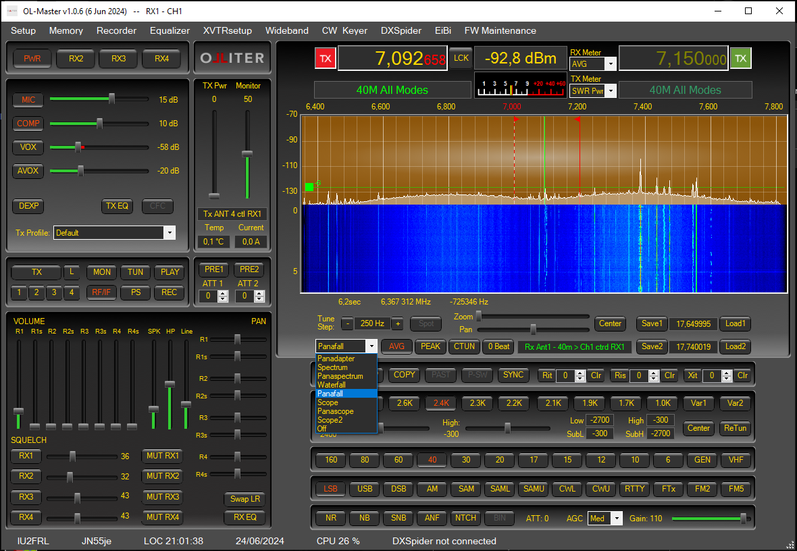

#### Interacting with the spectrum

The receiver spectrum can be interacted using the spectrum controls,
these allows zooming, panning and setting the tune step.


The spectrum can be rendered to display the average or the peak
mode[.]{.underline}


#### Setting the receiver mode

All main operative modes are supported by the transceiver, this can be
selected using the dedicated buttons.


Then, for each operating mode, the bandwidth can be adjusted as needed.


#### Adding additional receivers

RX1 is located in the main window of the software, additional receivers
can be enabled using the RX2, RX3 and RX4 buttons in the main window.

> [!WARNING]Using additional receivers may significantly impact the system
> load, if the system starts to lag, reduce the number of
> receivers, or reduce the sample rate.


#### Adjusting the receivers volume

The main and sub volumes, per each receiver can be configured using the
*Volume* controls group.


#### DSP options

Multiple software-based filters can be added to any receiver mode, these
can significantly improve the reception of a given signal. Some filters
are tuned to improve the voice quality, others to remove clicking,
background noise or unwanted whistles. Filters can be enabled using the
dedicated buttons.


### Firmware upgrade

Upgrade of the firmware is performed using the OL-Master application
with a dedicated menu.

> [!WARNING]Although the Olliter SDR has a recovery mode that can be enabled
> in case of major firmware failures, the firmware upgrade is a
> delicate process that requires some attention. Please read this
> chapter carefully before starting the procedure.

> [!WARNING]Make sure to close all background apps and to have a reliable
> power source for both the PC and the transceiver before
> attempting a firmware upgrade.

Extract the ZIP file containing the firmware anywhere on the local PC to
get the *.hex* file which contains the new firmware.

> [!WARNING]Extract the file on the local hard drive, do not use USB sticks,
> network drive or other unreliable locations that may create
> latency or issues.

Once the file is extracted you should see something like this:


Make sure the transceiver is ON and reachable on the local network, then
open OL-Master and select the *FW Maintenance* menu. The SDR should be
detected automatically by the software.

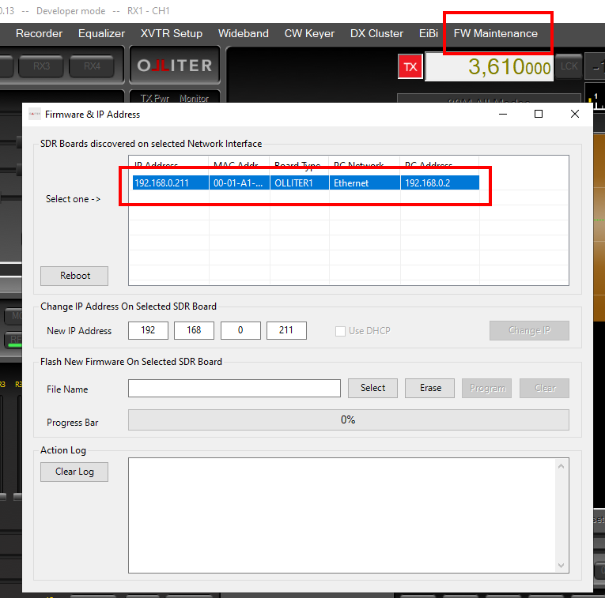

Using the Select button, navigate to the .hex file that was just
extracted and select it.

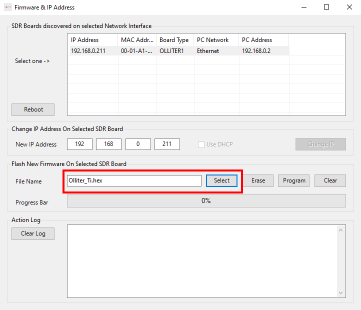

Once the file is selected, click the Program button to start the upgrade
procedure.

> [!WARNING]The upgrade procedure will take about a minute, please be
> patient.

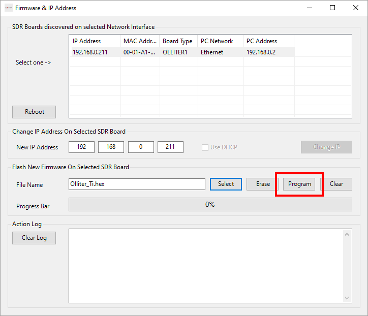

At first, the software will erase the content of the FPGA, this is a
monolithic task, so the software may look like it's frozen, please be
patient and just wait for the process to complete. Once the erase task
is completed, you should see the progress bar moving, and when it
reaches 100%, the transceiver should be restarted automatically.
  
> [!WARNING]If the process hangs after some minutes, or if any error occurs,
> please contact our customer assistance to get further
> assistance.

Wait for the upgrade window to close automatically after a couple of
seconds, then the process is complete, and the transceiver can be used
as normal.

## General recommendations

### Digital modes (FT8)

The following steps outline the proper configuration of the Olliter SDR
for operating in FT8 mode. Ensure that the settings are applied
carefully to avoid issues with audio processing and transmission.

#### Using Virtual Audio Cable (VAC)

- VAC RX1: Set the software to use VAC RX1 (or RX2, RX3, or RX4) for
    audio input, but do not use the \"Common VAC\" setting. This
    configuration ensures that the audio is correctly routed through the
    system without interference from other processes.

- VAC Type: Use monodirectional VAC for both input and output. You may
    need to configure separate VACs for input and output if your version
    supports bidirectional audio (such as Muzychenko\'s VAC). If your
    system uses bidirectional VAC, it is possible to use a single VAC
    for both input and output.

#### Audio Levels and Filters

- Compressor and Leveler: In FT8 mode, disable both the Compressor and
    Leveler. These audio processors are not required in FT8 and may
    cause distortion or improper modulation of the digital signal.

- VAC RX Level: Set the VAC RX level to approximately -27 dB. This
    ensures that the audio level is appropriate for digital signal
    processing, avoiding overload.

- VAC TX Level: Set the VAC TX level to 0 dB. This level ensures that
    the transmitted signal is clear and within the normal operational
    range for FT8 transmissions.

#### Transmit and Receive Filters

- TX Audio Filter: When WSJT-X is set to Radio -\> Split: NONE, the TX
    audio filter of the Olliter SDR must be adjusted to match the RX
    filter and the bandwidth used by FT8. For example, if you are using
    FT8 between 200 Hz and 3500 Hz, the TX audio filter should also be
    set between 200 Hz and 3500 Hz. Additionally, the RF filter should
    be aligned to this range.

- Split Mode (RIG or FAKE): If using WSJT-X with the \"Split\" mode
    set to either RIG or FAKE, there is no need to modify the TX audio
    filter beyond its normal range. In this case, set the TX filter to
    300 Hz to 2700 Hz, and FT8 will adjust the RF frequency to keep the
    audio signal centered within the bandwidth. The RF filter can be set
    freely, but note that it will limit the FT8 band visible on WSJT-X
    or similar software.

### SSB mode

When switching from FT8 or other digital modes to SSB, several
adjustments need to be made to ensure optimal audio performance. Follow
these instructions for setting up the Olliter SDR for SSB operations.

#### Microphone Voltage Considerations

- Yaesu Microphones: Typically require 5V for proper operation.

- ICOM Microphones: Typically require 8V. Verify the correct voltage
    before connecting the microphone to prevent damage or malfunction.

Please refer to the Microphone input chapter to see how to change the
microphone voltage.

#### Switching from FT8 to SSB

- Deactivate VAC: After using FT8 or other digital modes, ensure that
    VAC RX1 (or RX2, RX3, RX4) is deactivated before switching to SSB.
    Failure to do so may prevent audio from being transmitted properly.

#### Audio Processing Settings for SSB

- Leveler: Reactivate the Leveler when operating in SSB mode. The
    recommended setting is 7 dB, which helps maintain consistent output
    levels. After adjusting, verify that the Automatic Level Control
    (ALC) is set to approximately 3 dB.

- Compressor: For SSB, it is recommended to enable the Compressor at 8
    dB, or even 10 dB, especially when using the PureSignal feature.
    This improves the overall signal clarity and transmission quality.

#### Transmitting Filter Settings

- TX Audio Filter: In the Setup -\> Transmitting menu, adjust the TX
    audio filter according to your preferences. The default range for
    voice transmission is 300 Hz to 2700 Hz; this range provides a
    balance between intelligibility and bandwidth usage.

## Troubleshooting

This chapter contains some issues that may occur while operating the
transceiver, if the proposed solution does not work for you, please get
in touch with the customer care department.

### Olliter SDR Not Powering Up

Some linear power supplies with large filtering capacitors can cause the
Olliter SDR to power up improperly if it is connected before the power
supply is turned on. This occurs because the slow charging process of
the power supply\'s output filters triggers a low voltage alert in the
transceiver, activating the protection circuit and cutting off the
power.

**Solution**: Resetting the Protection Circuit

If the Olliter SDR does not show the green light when pressing the power
button after turning on the power supply, follow these steps:

- Disconnect the Input Voltage

    - Ensure the power supply remains on.

    - Disconnect the input voltage from the Olliter SDR.

- Wait for a Few Seconds:

    - Allow a couple of seconds for the protection circuit to reset.

- Reconnect the Power:

    - Reconnect the input voltage to the Olliter SDR.

By following these steps, the protection circuit should reset, and the
Olliter SDR should power up correctly. If the issue persists, ensure all
connections are secure and the power supply is functioning correctly.

### OL-Master reporting an error at startup

If the OL-Master software throws an error at startup stating "Cannot
load DLL 'ChannelMaster', cannot find the specified module" means that
some dependencies are not satisfied.

**Solution**: Refer to the System requirements chapter and make sure all
software and hardware requirements are met.

### OL-Master software crashed

If the OL-Master software crashes, it may be due to a variety of reasons, to help us diagnose the issue, please follow these steps:

- Navigate to the `%appdata%/OL-Master/Logs` folder
- Create a ZIP file containing all the files in the folder (all txt files and the `CrashDumps` folder)
- Send the ZIP file to the customer care department

The following additional details will help us diagnose the issue and provide a solution:

- The operating system version
- The hardware configuration of the PC
- The version of the OL-Master software
- The steps that led to the crash (or what was being done when the crash occurred)

### No voice from the front-panel microphone when transmitting

This issue can relate to multiple reasons, both software and hardware.

### VAC is enabled on the receiver

VAC will have priority over the microphone audio when transmitting, make
sure the VAC is disabled on the current receiver from the Setup menu to
enable the audio stream from the microphone.

**Solution**: disable VAC for the receiver that is being used

### Wrong microphone style

Each transceiver is shipped with a dedicated microphone wiring, a
different brand of microphone cannot be used without switching to a new
wiring kit. Contact the customer assistance service to receive
information on the wiring that was shipped with your transceiver or to
request a new microphone wiring kit.

**Solution**: verify the microphone wiring that was installed

### Wrong microphone voltage

Different microphone brands have different settings, make sure the right
microphone supply voltage was selected in the Setup menu.

**Solution**: verify the microphone supply voltage

### Improper microphone gain setting

Microphone gain is set from the upper-left panel of the OL-Master
software when in SSB mode, adjust the slider to get a good quality of
the transmitted audio.

Additional settings can be found in the Setup menu, like preamplifier or
the adjustment range of the main slider.

**Solution**: verify the microphone gain.

### Additional windows (like EiBi or Cluster) are not showing up

Windows sometimes "hides" some UI elements outside the screen
boundaries, just restore the window position to show it up.

**Solution**: Restoring the new window position

Hover the mouse to the OL-Master icon in the Windows bar (usually the
bottom part of your screen), you should see two or more windows as in
the picture


Right click on the window that has disappeared (the DX Spider Client in
this example) and select "Maximize". The window should now appear on
your main screen fully maximized, click on the title bar and drag it
anywhere to return to its normal size. The new location should be stored
in the database and recovered at the next reopening.

### User interface is not updating or feels slow

If the UI is laggy or unresponsive, it may be caused by a CPU overload,
the bottom bar of OL-Master shows the CPU utilization, if this is too
high, or even if the number is low but the interface feels "slow",
please consider closing other software running in background or use a
more powerful computer.

Another way to reduce the computing load of the software is to reduce
the sample rate from the OL-Master "Setup" menu, closing additional
receivers, turn off some advanced filtering (like NB2 or NR2) or
disabling external services like cluster or EiBi.

Please remember that on SDR devices, the biggest part of the job is
performed by the computer, so a powerful transceiver, requires an
adequately powerful PC.

**Solution**: Reduce the sample rate, close all background applications
or consider a PC hardware upgrade

### Audio from the speakers feels clicky or saturated

Audio levels is monitored by the AGC algorithm, if the AGC is set to any
manual setting and the volume is too high, the audio will be saturated
and sound bad.

**Solution**: lower the audio volume or enable AGC

### I connected the transceiver to a different PC and all settings were reset

Settings of the transceiver are not stored in the transceiver itself,
they are stored in an xml file which lives in the *%appdata%/OL-Master*
folder of the control PC. This file should be copied across the
different devices where OL-Master is installed

**Solution**: copy the database file to the new PC

### I get a weird error at startup telling my database cannot be loaded for some reason

The database probably got corrupted due to some hardware or software
issues, automatic backups are created by the software in the
%appdata%/OL-Master/Backups/Automatic folder, these files can be copied
back to *%appdata%/OL-Master* and renamed to *database.xml* to restore a
previous configuration

**Solution**: restore one of the automatic backups of the database

### You can't stop using the Olliter SDR transceiver

We're glad that you got to this point, if you can't stop using the
Olliter SDR, it means that our engineers have worked really hard to get
the most out of the best hardware which is currently available on the
market and you're enjoying the result. Please let's keep in touch with
our team using the Olliter website
[www.olliter.com](http://www.olliter.com) or our social media so you
will be notified at every new software release or be the first one to
test our new hardware.

## Additional resources

Some additional material was developed by our engineers to help you
troubleshoot or configure some sections of the software, here are some
links that every user should check out:

### Olliter website

This is the official website where all news are published, here you can
find manuals, software and all the information that are created for our
customers.

Olliter website: <https://www.olliter.com/>

Downloads section: <https://www.olliter.com/download.html>

OL-SDR page: <https://www.olliter.com/sdr.html>

### Olliter YouTube channel

This is the main source of information on how to configure third-party
software (like WSJT-X, CW-Skimmer or DX-Lab).

Link to the Olliter YouTube channel:
<https://www.youtube.com/@OLLITER-EU>

Link to the OL-Master Playlists:
<https://www.youtube.com/@OLLITER-EU/playlists>

### Olliter on Facebook

Here you can find some news about our devices, plus some previews of the
devices that are being developed or tested.

Link to the Olliter Facebook page: <https://www.facebook.com/Olliter/>

### Olliter on Instagram

Wanna see some cool stuff? Some pictures from events, presentations or
our laboratories? Instagram is the place for you.

Link to the Olliter Instagram page:
<https://www.instagram.com/_olliter_/>
