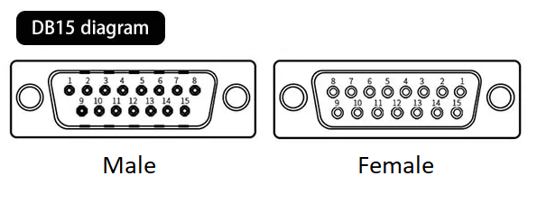

# OL-SD20A SDR Transceiver User Manual

## Contents of this manual

1. [Introduction](#introduction)
2. [Device overview](#device-overview)
    - [Device specifications](#device-specifications)
      - [General specifications](#general-specifications)
      - [Technical specifications](#technical-specifications)
    - [Front panel](#front-panel)
      - [Front panel LEDs](#front-panel-leds)
    - [Back panel](#back-panel)
      - [Connectors description](#connectors-description)
      - [Morse key jack](#morse-key-jack)
      - [Headphones output](#headphones-output)
      - [Microphone input](#microphone-input)
      - [Transverter interfaces](#transverter-interfaces)
      - [EXT IN](#ext-in)
      - [10MHz references](#10mhz-references)
      - [Pure Signal input](#pure-signal-input)
      - [PTT Output](#ptt-output)
      - [PA Band connector](#pa-band-connector)
      - [ACC Connector](#acc-connector)
      - [OC connector](#oc-connector)
      - [Power connector](#power-connector)
      - [Antenna connectors](#antenna-connectors)
      - [Ethernet connector](#ethernet-connector)
3. [System requirements](#system-requirements)
4. [Wiring the transceiver](#wiring-the-transceiver)
    - [Connecting of the PureSignal cable](#connecting-of-the-puresignal-cable)
    - [Connecting the power supply](#connecting-the-power-supply)
    - [Connecting the antenna](#connecting-the-antenna)
    - [Connecting the ethernet cable](#connecting-the-ethernet-cable)
    - [Connecting the microphone](#connecting-the-microphone)
5. [Connection of the SDR to the PC](#connection-of-the-sdr-to-the-pc)
    - [Default Olliter SDR IP address](#default-olliter-sdr-ip-address)
    - [Sample Ethernet connection](#sample-ethernet-connection)
    - [Changing the Olliter SDR IP address](#changing-the-olliter-sdr-ip-address)
6. [Usage of OL-Master](#usage-of-ol-master)
7. [General recommendations](#general-recommendations)
8. [Troubleshooting](#troubleshooting)

## Disclaimer for Proper Use of Amateur SDR Transceiver

> [!WARNING]
> Please read carefully before using the SDR transceiver

For the full hardware and software license, please refer to the following document: [General/README.md](../General/README.md)

## Important user notice

- This radio is designed to comply with your country's radio regulations.

- This radio was designed to operate on frequencies allocated exclusively for amateur radio use.

- To legally operate this radio, you must possess a valid amateur radio license of the appropriate class issued by your government.

- Radio frequency (RF) emissions from transmitters can potentially interfere with electronic devices, including pacemakers and defibrillators. If you suspect any interference with your medical device while operating this radio, immediately cease transmission and seek medical attention if necessary.

## Introduction

The main purpose of this guide is to help you configuring for the first time your Olliter SDR Transceiver.

This guide may not fully cover the hardware configuration of the device or every feature available on the software, it will cover the first steps to connect the SDR transceiver, receive and transmit.

## Device overview

This chapter covers the input and output of the Olliter SDR transceiver to guide the user when interfacing with external devices.

### Device specifications

#### General specifications

- Direct sampling SDR
  - 2x 16 bit dual-channsl RX ADC
  - 1x 16 bit TX DAC
- Up to 8 receivers
  - Each of the 4 hardware receiver channels can be split into two receivers on the same band for a total of 8 receivers on 4 different bands at the same time
- Full duplex capabilities
- Up to 1.5MHz of receive bandwitdh (per receiver)
- Ultra-low-noise master oscillator (122.88MHz)
- Thermally compensated reference oscillator (10MHz)
- 100KHz - 55MHz guaranteed continuous receive range
- Adjustable power output (maximum power depends on selected model)
- 2x 7W RMS audio output
- 8x open collector output
- 8x LVCMOS output
- 8x analog inputs
- 4x digital inputs

#### Technical specifications

The following specifications were reported from laboratory measurements from our engineers:

- Noise floor: better than -130dBm (0.07uV @2.4KHz bandwidth)
  - Measured with no preamp
- Noise figure: 12dB
- Reciprocal mixing noise: 107dB (@2.4KHz bandwidth)
- LVPECL differential master clock:
  - -155dBc/Hz (@10Khz)
  - -162dBc/Hz (absolute)
- TCXO stability: better than 50ppb (<0.7Hz @14MHz)
  - Accuracy guaranteed in temperature range between 0 and 70 Celsius
- Minimum discernable signal: -142dBm
- Dynamic range: 104dB
- Blocking range: 132dB (100 KHz)
- IMD: 38dBm (@14.0MHz)

### Front panel

1. Morse key input

2. Headphones output

3. Microphone input

4. Connection LED

5. Power button

6. Adjustable legs

7. Left speaker

8. Standby LED

9. Power-on LED

10. Right speaker

#### Front panel LEDs

The front panel offers four different LEDs, each LED have a different
meaning

1. Connection status: this LED is ON when OL-Master is communicating with the transceiver

2. Transmission: this LED is ON when the device is transmitting

3. Stand-by: this LED is ON when voltage is applied to the device

4. Power-on: this LED is ON when the power button is pressed and stays on when the device is operating (even if not communicating with OL-Master)

If the Power-on LED is not turning on when pressing the power button, please refer to the Troubleshooting chapter of this manual

[Front speakers]{#_Toc1852837891 .anchor}Front speakers

These speakers are controlled by OL-Master and can be used to play the demodulated signal that is tuned. The onboard speakers can be enabled or disabled from OL-Master, volume control is also provided by the software

### Back panel

1. Receiving line for the transverter interface 1

2. Transmitting line for the transverter interface 1

3. Receiving line for the transverter interface 2

4. Transmitting line for the transverter interface 2

5. Pure signal input

6. Pure signal output

7. EXT IN (unfiltered RF input)

8. 10MHz input from an external oscillator (GPSDO or rubidium  reference)

9. 10MHz output for external devices (such as transverters)

10. Open collector I/O (can be configured from OL-Master)

11. Speaker connection (high power output, designed for external 8-ohm speakers)

12. Internal or external speaker selector

13. Power supply input (13.8V DC)

14. Antenna 1 receiving and transmitting connector

15. Antenna 2 receiving and transmitting connector

16. Antenna 3 receiving and transmitting connector

17. Antenna 4 receiving and transmitting connector

18. Serial number location

19. Transverter 1 interface (digital inputs and outputs to control external transverters)

20. Transverter 2 interface (digital inputs and outputs to control external transverters)

21. External accessories interface (digital inputs and outputs)

22. RCA audio output (low power output, to be sent to the line-in of external audio devices)

23. RCA audio input (low power input, to be used as transmitting audio line)

24. Open collector PTT output

25. External PTT input (active low)

26. Band output (digital output)

27. Ethernet interface (1Gbps only)

#### Connectors description

Here is a description of the inputs and outputs of the Olliter SDR transceiver. Some of these connections are highly sensitive to ESD, overvoltage, short-circuit, overcurrent and more, please take all the recommended measures when connecting external devices.

> [!WARNING]
> The warranty for your Olliter SDR device will be voided if our customer assistance department determines that the device has been damaged or rendered inoperative due to improper connection of external devices.

> [!WARNING]
> The warranty for your Olliter SDR will be voided if our customer assistance department determines that the device has been damaged or rendered inoperative due to connection of external devices that generate or absorb excessive current or voltage

#### Morse key jack

This ¼ inch (6.35mm) jack is used to connect either a paddle or a straight key. When using a paddle, the DOT and DASHES can be swapped from the CW menu of OL-Master settings.

This connector uses either 5V or 3V3 pull-up resistors. Voltage can be selected by moving the internal "3.3 -- 5V I/O" jumper.

#### Headphones output

This output is designed to drive standard headphones with a nominal
impedance of 16Ω impedance, output level is 50mW for a -75dB THD.

> [!WARNING]
> Prolonged use of headphones at high volume can cause permanent hearing dagame. Adjust the volume to a safe level to protect your ears.

#### Microphone input

> [!WARNING]
> If the transceiver was ordered with a Icom wiring, a Yaesu microphone cannot be used and vice-versa. Using a different microphone style can damage the transceiver and/or the microphone.

This input should be chosen when placing the order for the Olliter SDR transceiver. This input is designed to work with either Icom (such as the SM-30) or Yaesu (such as M-70) microphones.

In addition to the microphone wiring that was requested, and independently from the user choice, a balanced input for a dynamic capsule is also available on the same connector.

> [!WARNING]
> Before connecting any kind of microphone to the transceiver, please adjust the voltage settings in the Setup menu of OL-Master software. Incorrect voltage settings may damage the transceiver and/or the microphone.

Selection between 5V, 8V or none can be toggled in the Setup menu of OL-Master.

Advanced features (like up/down, scan, etc.) are not available.

| Pin | Transceiver (Icom Wiring) | Icom SM-30 Dynamic Microphone |
|-----|--------------------------------|------------------------------|
| 1 | Microphone signal | Balanced input + |
| 2 | +8V microphone power | N.C. |
| 3 | N.C. | N.C. |
| 4 | N.C. | Balanced input - |
| 5 | PTT signal | PTT signal |
| 6 | PTT GND | PTT GND |
| 7 | Microphone GND | GND |
| 8 | N.C. | N.C. |

| Pin | Transceiver (Yaesu Wiring) | Yaesu M-70 Dynamic Microphone |
|-----|--------------------------------|------------------------------|
| 1 | N.C. | N.C. |
| 2 | +5V microphone power | N.C. |
| 3 | N.C. | N.C. |
| 4 | N.C. | Balanced input - |
| 5 | PTT GND | PTT GND |
| 6 | PTT Signal | PTT Signal |
| 7 | Microphone GND | GND |
| 8 | Microphone signal | Balanced input + |

*Icom and the Icom logo are registered trademarks of Icom Incorporated (Japan)*

*Yaesu and the Yaesu logo are registered trademarks of Yaesu Musen Co., Ltd.*

#### Transverter interfaces

The transverter input and outputs are designed to drive external devices to provide additional bands to the transceiver.

The transverter input 1 is connected to the CH1 line of the SDR, while the transverter input 2 is connected to the CH2 line of the SDR. Both inputs are passed through a dedicated 50MHz low-pass filter, a 32dB software-controlled attenuator and a 20dB amplifier. The suggested maximum input should be -2dBm (assuming no attenuator is used).

The nominal output for the transverter transmission line is 10dBm, this value may vary a little depending on the IF frequency that is configured. The transmission signal is passed through a 50MHz low-pass filter, and a programmable attenuator (which is controlled by the TX Power slider in OL-Master).

Transverters can be configured using the dedicated section of the OL-Master software.

#### EXT IN

> [!WARNING]
> The EXT IN connector provide direct access to the ADC2 device
> inside the transceiver, excessive power input can permanently
> damage the internal circuits

This input provides an unfiltered path to the CH2 line of the
transceiver, it is typically used to interface with external devices
where filters are already installed (such as panadapter interfaces).

To enable this feature please select RX2 as receiver channel for the
receiver that is going to be used, then configure if the external input should be used only during RX, TX or both.

#### 10MHz references

The Olliter SDR transceiver can be connected to an external 10MHz reference to provide better frequency stability, this is very convenient when working with high-frequency devices like microwave transverters.

The 10MHz input (labelled as GPS IN) is a 50Ω input between -15dBm and +5dBm. This input is protected against overvoltage but using an attenuator (if needed) is recommended.

The 10MHz output (labelled as OUT) provides a 3.3V CMOS output with a series resistance (used as short-circuit protection). This output can only be used as a frequency reference, and it was not designed to provide more than 20mA. This output comes from the internal TCXO when no external reference is applied.

#### Pure Signal input

PureSignal features an input level control loop with a 30 dB range to minimize spurious emissions and get cleaner RF output emissions. At full power, with an input level of 3 dBm, the automatic attenuation stabilizes around 20 dB.

This means that PureSignal can still correct the amplifier even when the output power is only one-hundredth of its maximum value. This is particularly useful when the instantaneous voice level is low.

For optimal performance, it is recommended to set external attenuators to limit the input level to +3 dBm at full power, ensuring that the automatic attenuator stabilizes around 20 dB.

> [!WARNING]
> The maximum level before the PureSignal receive chain saturates is approximately +10 dBm, equivalent to 0.7 Vrms or 1 Vpk. Exceeding these values can cause permanent damage to the transceiver boards.

> [!TIP]
> We observed that most commercial amplifiers are producing a 0dBm (or -60dBc) power at the PureSignal output, this power level is enough to be used with the OL-SD20A

##### PureSignal System Verification Procedure

To ensure proper operation of the PureSignal system, follow the steps below:

1. Initiate a Two-Tone Test
   - Begin with a two-tone test at low power levels.
   - Navigate to `Setup > PureSignal` to monitor the system's behavior.

2. Check the Automatic Attenuator Level
   - Observe the value of the automatic attenuator displayed in the setup screen.

3. Interpret the readings as follows:
   - Feedback too low: If the value stays at 0 dB, the feedback signal level is insufficient.
   - Feedback too high: If the value remains at –31 dB and the RX1 label on the panel is blue, the feedback signal level is excessive.

4. Power Amplifier Performance Evaluation:
   - If the power amplifier (PA) is indeed producing 1 kW, a cancellation level on the PureSignal output of –60 dBc is considered acceptable.

#### PTT Output

The radio features a PTT OUT output located on the back panel, designed for external device control. This output is open-drain, meaning it remains open during reception (RX) and is grounded during transmission (TX).

> [!WARNING]
> Maximum Drain-Source Voltage (Vdss): 20V (must never be exceeded)

> [!WARNING]
> Maximum Current: 0.5A (user is responsible for ensuring this limit is not exceeded)

When controlling a relay, it is essential to place a flyback diode in parallel with the relay coil to prevent voltage spikes that could damage the internal FET.

> [!TIP]
> Most amplifiers includes an internal 4.7KΩ pull-up resistor to its internal 5V supply. As a result, it can be directly connected to the OL-SDR PTT OUT without requiring additional components. For optimal performance and minimal interference, it is recommended to use a shielded cable with an RCA connector.

> [!TIP]
> In Setup → Options, the radio can be configured to activate an adjustable delay for RF output after PTT ON activation. This feature ensures that external relays have sufficient time to switch the antenna connection before transmission begins.

#### PA Band connector

This connector offers some digital outputs that can be used to drive external antenna switches or amplifiers.

These outputs can be programmed by the user using the Setup menu of OL-Master.

These outputs are normally in a LOW state using a pull-down resistor.

The voltage that is provided by this port depends on the internal "3.3 -- 5V I/O" jumper. Maximum available current is limited with a 220Ω series resistor.

| DB9 Pin | Software Output |
|---------|-----------------|
| 1 | Digital out 1 |
| 2 | Digital out 2 |
| 3 | Digital out 3 |
| 4 | Digital out 4 |
| 5 | GND |
| 6 | Digital out 5 |
| 7 | Digital out 6 |
| 8 | Digital out 7 |
| 9 | Digital out 8 |

#### ACC Connector

This connector offers some inputs to control several features of the SDR, such as PTT controls for RX2, RX3 and RX4, an external inhibit line, and two additional analog inputs that can be used to get information from external devices (like temperature probes or flow meters).

The voltage that can be applied to the digital input port depends on the internal "3.3 -- 5V I/O" jumper. In any case, it should never exceed the configured voltage.

| State | 3.3V I/O Range | 5V I/O Range |
|------------|---------------|--------------|
| Low state | 0V to 0.8V | 0V to 1.5V |
| High state | 2V to 3.3V | 3.5V to 5V |

The voltage range for both ADC0 and ADC1 is 0V to 3.3V. Excessive voltage can cause severe damage to the ADC circuitry.

Pins 6 and 8 have an internal 4.7KΩ pull-up resistor, while pins 7 and 9 have an internal 4.7KΩ pull-down resistor.

| DB9 Pin | Software Output |
|---------|---------------------------|
| 1 | GND |
| 2 | N.C. |
| 3 | ADC in 1 |
| 4 | ADC in 0 |
| 5 | GND |
| 6 | PTT RX2 (active LOW) |
| 7 | PTT RX4 (active HIGH) |
| 8 | PTT RX3 (active LOW) |
| 9 | Ext Inhibit (active HIGH) |

#### OC connector

This connector offers 8 open-collector outputs that can be used to drive external accessories like power amplifiers or antenna relays.

The maximum V~CE~ that can be used at the open-collector outputs is 48V DC.

The 13.8V DC lines are derived from the main power supply and are protected by a 250mA resettable fuse.

| DB15 Pin | Software Output |
|----------|--------------------------|
| 1 | GND |
| 2 | OUT 2 |
| 3 | OUT 4 |
| 4 | OUT 6 |
| 5 | OUT 8 |
| 6 | GND |
| 7 | GND |
| 8 | 13.8V |
| 9 | OUT 1 |
| 10 | OUT 3 |
| 11 | OUT 5 |
| 12 | OUT 7 |
| 13 | Open-collector common |
| 14 | GND |
| 15 | 13.8V |

External relay connection example:

#### Power connector

Please refer to the Connecting the power supply chapter for further information

#### Antenna connectors

These four BNC connectors are used by the transceiver to receive and transmit. Different bands can receive or transmit on different antennas, mapping between bands, mode and antenna can be done in the Setup menu of OL-Master.

Please refer to the Connecting the antenna for further information

#### Ethernet connector

> [!WARNING]
> The transceiver does not accept any link speed slower than 1Gbps. Network devices running at 10/100Mbps are not supported and will not work.

The ethernet port is used to communicate with the OL-Master application through local network, make sure to use high-quality shielded wires to achieve best performances.

## System requirements

A detailed description of the hardware and software requirements needed to run the OL-Master software can be found in the [OL-Master](../OL-Master_v1/README.md) manual.

## Wiring the transceiver

> [!WARNING]
> Electrostatic Discharge (ESD) can cause severe damage to electrical circuits, potentially leading to costly repairs or replacements. Always take measures to protect your equipment. These safety measures include but are not limited to:
>
> - Proper grounding: make sure all equipment and workstations are properly grounded
> - Avoid static-inducing clothing: avoid wearing synthetic materials that generate static electricity 
> - Handle components with care: touch components only by their edges or the grounding case avoiding touching pins and circuitry

Connecting the transceiver is simple but a couple of considerations and safety measures are needed, please read carefully the wiring instructions to prevent damages to the Olliter SDR.

### Connecting of the PureSignal cable

To achieve optimal transmission quality and reduce the spurious emissions, the Pure Signal technology is supported by the Olliter SDR transceiver.

Pure Signal is the name given to the theory and implementation of the clean transmission logic developed by the OpenHPSDR team and implemented in both the Olliter SDR software and transceiver. The algorithm behind the Pure Signal technology is quite simple, when both the drive applied to the Digital-to-analogue converter (DAC) and the output as measured at the antenna are known it is possible to modify the drive so that the output is as clean as possible.

The Pure Signal technology is enabled by connecting the PS IN with the PS OUT using the provided SMA to SMA coaxial cable.

### Connecting the power supply

The Olliter SDR was designed to operate from a stable and constant power supply which is capable of continuously delivering 13.8V at 5A for the 20W model.

An integrated protection circuit is added to the transceiver which can help in protecting the radio from excessive voltage fluctuations by cutting the power line and turning off the device.

> [!WARNING]
> The integrated protection circuit should not be considered a surge, lightning or electrostatic protection, it was designed to protect the circuitry from excessive or low voltages which may negatively impact the transceiver performances.

Connect the power supply to the Olliter SDR by using high-quality Anderson PowerPole® connectors. Wire size should be chosen according to the length of the connection, here are our suggestions:

- Wires shorter than 2 meters (6.5ft) long will require 2mm2 (AWG14) wires
- Wires between 2 and 4 meters (6.5ft to 13ft) will require 4mm2 wires
- Wires longer than 4 meters (13ft) are not recommended as they may pick up excessive noise from the surrounding environment or cause excessive voltage fluctuations

Make sure to connect all the needed wires before turning on the power supply.

If the transceiver does not show the red (standby) light after applying power, please refer to the Troubleshooting chapter.

### Connecting the antenna

Up to 4 antennas can be connected to the Olliter SDR, these can be configured in software to allow receiving and transmitting on different bands with different antennas.

To begin, connect an antenna using a male BNC connector to the ANT1 socket.

### Connecting the ethernet cable

To interface the transceiver with the local network, please refer to the Connection of the SDR to the PC chapter of this manual.

### Connecting the microphone

Each device comes with a dedicated microphone wiring which should be selected when ordering the transceiver, use the front 8-pin socket to connect the microphone.

## Connection of the SDR to the PC

Connection of the transceiver to the PC is performed using an Ethernet/IP protocol, make sure to use high quality network equipment and cables to achieve best results.

### Default Olliter SDR IP address

The transceiver comes with a preconfigured IP address set to 192.168.1.111, if this address is valid on your local network (meaning your local network has an address family like 192.168.1.X and the subnet mask is 255.255.255.0), you can just plug the device to the local etwork and skip the IP address setup guide.

> [!WARNING]
> Before applying any voltage to the SDR, connect the device to your home switch/router using a high-quality CAT5 (or superior) ethernet cable

> [!WARNING]
> The transceiver can only communicate at 1Gbps, if the switch/router or the master PC does not support such speed, the connection may be unavailable or unstable 

### Sample Ethernet connection

The following schematic illustrates the recommended connection of the SDR device to the PC.

> 

### Changing the Olliter SDR IP address

Management of the IP address is performed using OL-Master, if the default IP address (192.168.1.111) is not valid or available on your local network, follow this procedure to change it to a valid one.

For the full procedure, please see: [Changing IP Address of a OL-SD20A transceiver](./ChangingIpAddress.md)

## Usage of OL-Master

Please refer to the [OL-Master](../OL-Master_v1/README.md) manual for detailed instructions on how to use the software.

## General recommendations

Please refer to the [OL-Master](../OL-Master_v1/GeneralRecommendations.md) manual for general recommendations on how to use the software.

## Troubleshooting

Please refer to the [OL-Master](../OL-Master_v1/Troubleshooting.md) manual for troubleshooting instructions.
